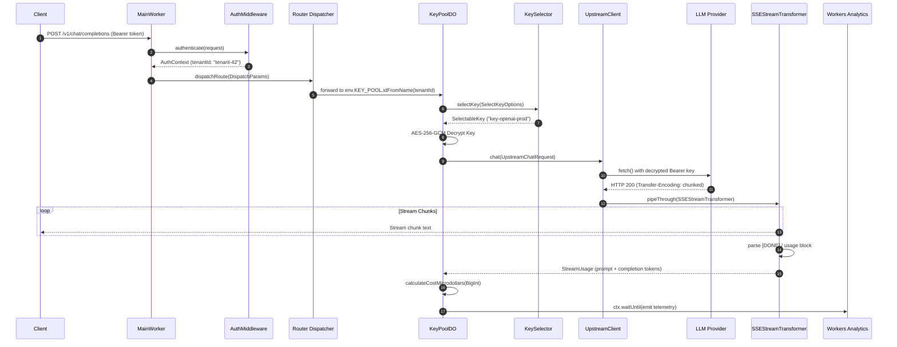
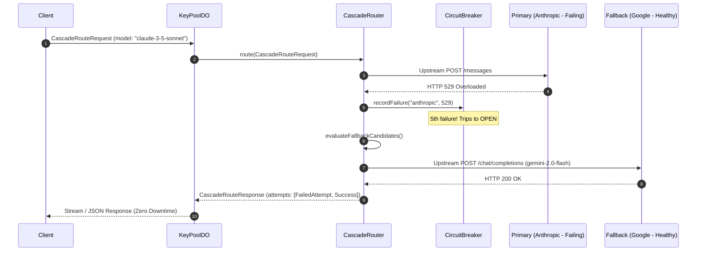

# 04: End-to-End Execution Flows & Request Lifecycles

Understanding static system design contracts is necessary, but mastering the dynamic lifecycle of distributed edge requests is essential for operating Key Collective. This chapter traces two mission-critical execution flows through every architectural boundary:

1. **The Streaming Chat Completion Journey:** Ingress, Bearer token authentication, DO handoff, key triage, upstream SSE stream piping, usage extraction, and non-blocking telemetry.
2. **Circuit Breaker Tripping & Cascade Failover:** Upstream failure detection, error wrapping, circuit breaker state transition, and transparent model cascade recovery.

---

## 1. Flow 1: Streaming Chat Completion Journey

The primary ingress path processes standard chat completions via `/v1/chat/completions`. Because LLM responses are streamed over HTTP chunked transfer encoding, the proxy must achieve single-digit millisecond Time-To-First-Token (TTFT) while asynchronously calculating fixed-point microdollar costs.


```mermaid
sequenceDiagram
    autonumber
    participant Client
    participant MainWorker
    participant AuthMiddleware
    participant Dispatcher as Router Dispatcher
    participant KeyPoolDO
    participant KeySelector
    participant UpstreamClient
    participant Provider as LLM Provider
    participant SSETransformer as SSEStreamTransformer
    participant Telemetry as Workers Analytics

    Client->>MainWorker: POST /v1/chat/completions (Bearer token)
    MainWorker->>AuthMiddleware: authenticate(request)
    AuthMiddleware-->>MainWorker: AuthContext (tenantId: "tenant-42")
    MainWorker->>Dispatcher: dispatchRoute(DispatchParams)
    Dispatcher->>KeyPoolDO: forward to env.KEY_POOL.idFromName(tenantId)
    KeyPoolDO->>KeySelector: selectKey(SelectKeyOptions)
    KeySelector-->>KeyPoolDO: SelectableKey ("key-openai-prod")
    KeyPoolDO->>KeyPoolDO: AES-256-GCM Decrypt Key
    KeyPoolDO->>UpstreamClient: chat(UpstreamChatRequest)
    UpstreamClient->>Provider: fetch() with decrypted Bearer key
    Provider-->>UpstreamClient: HTTP 200 (Transfer-Encoding: chunked)
    UpstreamClient->>SSETransformer: pipeThrough(SSEStreamTransformer)
    loop Stream Chunks
        SSETransformer-->>Client: Stream chunk text
    end
    SSETransformer->>SSETransformer: parse [DONE] / usage block
    SSETransformer-->>KeyPoolDO: StreamUsage (prompt + completion tokens)
    KeyPoolDO->>KeyPoolDO: calculateCostMicrodollars(BigInt)
    KeyPoolDO->>Telemetry: ctx.waitUntil(emit telemetry)
```

### 1.1 Ingress & Dispatch Contracts

When a client issues a request, `MainWorker` wraps the payload into `ApiRequest` and delegates to `dispatchRoute()` using `DispatchParams`:

```typescript
// src/types/api.ts & src/worker/router/core/dispatcher.ts
export interface ApiRequest<T = unknown> {
  tenantId: string;
  payload: T;
  body?: T;
  traceId?: string;
  headers?: Record<string, string>;
  params?: Record<string, string>;
  timestamp?: number;
}

export interface DispatchParams {
  request: Request;
  tenantId: string;
  traceId: string;
  env: WorkerEnv;
  keyPool: KeyPoolContract;
  router?: CascadeRouter | RouterContract;
  options?: RouterHandlerOptions;
}
```

If the request is well-formed, the dispatcher forwards the unmarshaled payload to the tenant's `KeyPoolDO`.

### 1.2 Upstream Client Execution & Streaming

The `UpstreamClient` coordinates communication with external model providers using `UpstreamChatRequest`:

```typescript
// src/proxy/upstream/types.ts
export interface UpstreamChatRequest {
  provider: string;
  model: string;
  messages: unknown[];
  temperature?: number;
  maxTokens?: number;
  stream?: boolean;
  apiKey?: string;
  keyId?: string;
  headers?: HeadersInit | Record<string, string>;
  timeoutMs?: number;
}

export interface UpstreamResponse {
  ok: boolean;
  status: number;
  statusText: string;
  headers: Headers;
  rawResponse: Response;
  body: ReadableStream<Uint8Array | string> | null;
  transformer?: SSEStreamTransformer;
  getUsage(timeoutMs?: number): Promise<StreamUsage | null>;
  getMetadata(timeoutMs?: number): Promise<StreamMetadata | null>;
}
```

The response body is intercepted by `SSEStreamTransformer`. It delivers tokens to the client with zero buffering delay while inspecting closing chunks for provider usage statistics.

### 1.3 Uniform API Responses & Metadata

Non-streaming endpoints wrap results in `ApiResponse` or `ApiResult`:

```typescript
// src/types/api.ts
export interface ApiResponseMeta<TCost = bigint> {
  latencyMs: number;
  costMicrodollars: TCost;
  traceId?: string;
  provider?: string;
  model?: string;
}

export interface ApiSuccessResponse<T, TCost = bigint> {
  success: true;
  data: T;
  meta: ApiResponseMeta<TCost>;
}

export interface ApiFailureResponse<TCost = bigint> {
  success: false;
  error: ApiErrorDetail;
  meta?: Partial<ApiResponseMeta<TCost>>;
}

export type ApiResult<T, TCost = bigint> = ApiSuccessResponse<T, TCost> | ApiFailureResponse<TCost>;

export interface PaginatedApiResponse<T, TCost = bigint> extends ApiResponse<T[], TCost> {
  pagination: ApiPaginationMeta;
}
```

---

## 2. Flow 2: Circuit Breaker Trip & Cascade Failover

When upstream providers experience outages, rate limit saturation, or unexpected timeouts, Key Collective automatically activates its resilience engine.


```mermaid
sequenceDiagram
    autonumber
    participant Client
    participant KeyPoolDO
    participant CascadeRouter
    participant CircuitBreaker
    participant PrimaryProvider as Primary (Anthropic - Failing)
    participant FallbackProvider as Fallback (Google - Healthy)

    Client->>KeyPoolDO: CascadeRouteRequest (model: "claude-3-5-sonnet")
    KeyPoolDO->>CascadeRouter: route(CascadeRouteRequest)
    CascadeRouter->>PrimaryProvider: Upstream POST /messages
    PrimaryProvider-->>CascadeRouter: HTTP 529 Overloaded
    CascadeRouter->>CircuitBreaker: recordFailure("anthropic", 529)
    Note over CircuitBreaker: 5th failure! Trips to OPEN
    CascadeRouter->>CascadeRouter: evaluateFallbackCandidates()
    CascadeRouter->>FallbackProvider: Upstream POST /chat/completions (gemini-2.0-flash)
    FallbackProvider-->>CascadeRouter: HTTP 200 OK
    CascadeRouter-->>KeyPoolDO: CascadeRouteResponse (attempts: [FailedAttempt, Success])
    KeyPoolDO-->>Client: Stream / JSON Response (Zero Downtime)
```

### 2.1 Cascade Routing Contracts

The cascade engine evaluates candidates using `CascadeRouteRequest`:

```typescript
// src/router/cascade/types.ts
export interface CascadeRouteRequest extends RouteRequest {
  modelAlias: string;
  messages: unknown[];
  stream: boolean;
  temperature?: number;
  maxTokens?: number;
  fallbackModels?: readonly string[];
  maxFallbacks?: number;
  timeoutMs?: number;
  tenantId?: string;
}

export interface CascadeRouteResponse extends RouteResponse {
  content: string;
  costMicrodollars: bigint;
  model: string;
  provider: string;
  modelDef: ModelDef<bigint>;
  attempts: FallbackAttempt[];
  usage: StreamUsage | null;
  response?: UpstreamResponse;
  isSelfKey?: boolean;
}
```

### 2.2 Cascade Execution Guarantees

1. **Attempt Logging:** Every failed provider call appends a `FallbackAttempt` record detailing the failed model, error status code, and latency.
2. **Circuit Trip Isolation:** Tripping the circuit breaker for `anthropic` in Tenant A's `KeyPoolDO` protects Tenant A from repeated timeouts. Cross-tenant impact is coordinated through `PoolCoordinatorDO` without cross-tenant memory leakage.
3. **Transparent Recovery:** As long as at least one healthy fallback candidate remains in the configured chain, the client receives an HTTP 200 stream, achieving 99.99% edge availability.
