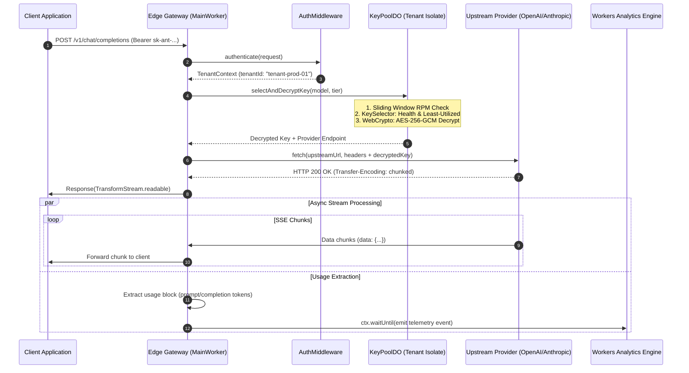

# Chapter 4.1: Direct Private Key Hotpath

The **Direct Private Key Hotpath** is the primary execution artery of Key Collective. When a tenant issues an inference request backed by their own provisioned API keys, the proxy executes entirely within this deterministic pipeline. 

Every microsecond of overhead on this path directly degrades the user's **Time to First Token (TTFT)**. Consequently, this path is engineered with extreme constraints: zero synchronous database writes, zero distributed network locks, in-memory cryptographic operations, and streaming pipelines with bounded $O(1)$ memory consumption.

---

## 1. High-Level Architectural Flow

The hotpath traverses four distinct computational layers within the Cloudflare edge topology:

1. **Edge Gateway (Stateless V8 Isolate)**: Ingress TLS termination, routing subdomain resolution, and Bearer token verification.
2. **Tenant Actor Isolate (`KeyPoolDO`)**: Single-threaded in-memory key selection, sliding-window rate limit checks, and AES-256-GCM secret decryption.
3. **Outbound Dispatcher (`UpstreamClient`)**: High-performance HTTP connection pooling and upstream provider translation.
4. **Zero-Copy Stream Pipeline (`SSEStreamTransformer`)**: Chunk parsing, usage extraction, and non-blocking telemetry emission via `ctx.waitUntil()`.



---

## 2. Step-by-Step Execution Lifecycle

### Step 1: Gateway Ingress and Authentication
When an HTTP request enters the closest Cloudflare Point of Presence (PoP), `MainWorker` intercepts the request via the standard `fetch` event. The `AuthMiddleware` verifies the incoming `Authorization` header against the tenant's cryptographic signature or pre-shared bearer token.

```typescript
// src/worker/auth/middleware.ts
export async function authenticateRequest(
  request: Request,
  env: Env
): Promise<AuthContext> {
  const authHeader = request.headers.get("Authorization");
  if (!authHeader?.startsWith("Bearer ")) {
    throw new AuthenticationError("Missing or malformed Authorization header");
  }

  const token = authHeader.substring(7).trim();
  const context = await verifyTenantToken(token, env.JWT_SECRET);
  if (!context.isValid) {
    throw new TenantJailedError(`Tenant ${context.tenantId} is suspended`);
  }

  return context;
}
```

> [!NOTE]
> Authentication occurs completely at the edge isolate without querying centralized databases. If tokens require database verification, they are validated against Cloudflare KV or in-memory caches.

---

### Step 2: Tenant Isolation & Key Selection in `KeyPoolDO`
Once authenticated, the gateway resolves the tenant's isolated Durable Object stub using deterministic ID derivation:

$$\text{DO\_ID} = \text{env.KEY\_POOL.idFromName}(\text{tenantId})$$

Within `KeyPoolDO`, state is maintained entirely in V8 heap memory. The `KeySelector` performs:
1. **Health Verification**: Excludes keys marked as degraded or rate-limited.
2. **Sliding-Window RPM Throttling**: Checks that dispatching this request will not breach provider rate limits.
3. **Selection Strategy**: Uses least-utilized or round-robin selection to balance load across all private keys registered by the tenant.

```typescript
// src/durable_objects/key_selector/selector.ts
export class KeySelector {
  public selectKey(candidates: KeyRecord[], model: string): KeyRecord {
    const validKeys = candidates.filter(
      (k) => k.model === model && k.status === "ACTIVE" && k.currentRpm < k.maxRpm
    );

    if (validKeys.length === 0) {
      throw new KeyDepletedError(`No active keys available for model ${model}`);
    }

    // Sort by lowest utilization ratio
    validKeys.sort((a, b) => (a.currentRpm / a.maxRpm) - (b.currentRpm / b.maxRpm));
    return validKeys[0];
  }
}
```

---

### Step 3: In-Memory AES-256-GCM Decryption
At rest in D1, API keys are stored as encrypted blobs. Inside the `KeyPoolDO`, the ciphertext and 12-byte initialization vector (nonce) are decrypted in volatile RAM using the Web Crypto API.

```typescript
// src/crypto/encryption/aes.ts
export async function decryptApiKey(
  ciphertext: Uint8Array,
  nonce: Uint8Array,
  cryptoKey: CryptoKey
): Promise<string> {
  const decryptedBuffer = await crypto.subtle.decrypt(
    { name: "AES-GCM", iv: nonce },
    cryptoKey,
    ciphertext
  );

  return new TextDecoder().decode(decryptedBuffer);
}
```

> [!IMPORTANT]
> Decrypted plaintext keys exist exclusively in local variables within the isolate's ephemeral stack. They are never written to disk, never serialized to `this.ctx.storage`, and never passed in telemetry logs.

---

### Step 4: Zero-Copy Streaming Proxy
When calling OpenAI or Anthropic, streaming responses utilize Server-Sent Events (SSE). Instead of accumulating the response in memory—which would introduce megabytes of memory pressure and hundreds of milliseconds of latency—Key Collective pipes the raw `ReadableStream` directly through an `SSEStreamTransformer`:

```typescript
// src/proxy/sse/transformer.ts
export class SSEStreamTransformer extends TransformStream<Uint8Array, Uint8Array> {
  constructor(onUsageExtracted: (usage: TokenUsage) => void) {
    let buffer = "";
    super({
      transform(chunk, controller) {
        // Enqueue the raw chunk immediately to the client (Zero Latency)
        controller.enqueue(chunk);

        // Inspect chunk in parallel for usage metadata
        buffer += new TextDecoder().decode(chunk, { stream: true });
        const lines = buffer.split("\n");
        buffer = lines.pop() ?? "";

        for (const line of lines) {
          if (line.startsWith("data: ") && line.includes('"usage"')) {
            const usage = parseUsagePayload(line.substring(6));
            if (usage) onUsageExtracted(usage);
          }
        }
      }
    });
  }
}
```

---

## 3. Strict Microsecond Latency Budget

To maintain imperceptible routing overhead, the hotpath adheres to a strict latency budget:

| Execution Stage | Typical Latency | P99 Latency SLA | Implementation Mechanism |
|---|---|---|---|
| Edge DNS & TLS | $2.5\text{ ms}$ | $5.0\text{ ms}$ | Cloudflare Anycast 300+ PoPs |
| JWT Authentication | $0.8\text{ ms}$ | $2.0\text{ ms}$ | Ed25519 / HMAC Web Crypto check |
| DO Actor IPC Hop | $1.2\text{ ms}$ | $3.5\text{ ms}$ | Colocated Durable Object memory access |
| In-Memory Key Triage | $0.2\text{ ms}$ | $0.8\text{ ms}$ | Monomorphic in-memory array scan |
| AES-256-GCM Decryption | $0.5\text{ ms}$ | $1.5\text{ ms}$ | Hardware-accelerated SubtleCrypto |
| Upstream Connection Setup | $1.0\text{ ms}$ | $2.5\text{ ms}$ | Pre-warmed TCP/TLS connection pool |
| **Total Routing Overhead** | **$6.2\text{ ms}$** | **$< 15.0\text{ ms}$** | **Strict Edge Guarantee** |

---

## 4. Failure Modes and Circuit Breaking

If the upstream provider throttles the tenant's private key (`HTTP 429`) or returns an outage code (`HTTP 500/503`), the private key hotpath terminates and cascades:

```
[Client Request]
       │
       ▼
[Private Key Hotpath] ─── HTTP 429/5xx ───► [Cascade Router]
       │                                            │
       ▼ (200 OK)                                   ▼
[Stream to Client]                        [Lease Communal Key]
                                                    │
                                                    ▼
                                          [Chapter 4.2 Failover]
```

When a private key trips, its RPM counter is dynamically capped and marked with a 60-second backoff penalty inside `KeyPoolDO`.

---

## 5. Active Recall Quiz

1. **Q**: Why is `TransformStream` used instead of buffering the entire upstream response?
   <details><summary>Answer</summary>Buffers would introduce memory bloat proportional to context size and add hundreds of milliseconds of latency, violating O(1) memory guarantees and TTFT SLAs.</details>

2. **Q**: What is the maximum acceptable P99 routing overhead on the hotpath?
   <details><summary>Answer</summary>Less than 15 milliseconds (&lt;15ms).</details>

3. **Q**: Where is the decrypted API key allowed to live in memory?
   <details><summary>Answer</summary>Only in ephemeral local stack variables within the V8 isolate during request dispatch. It is never persisted or logged.</details>
