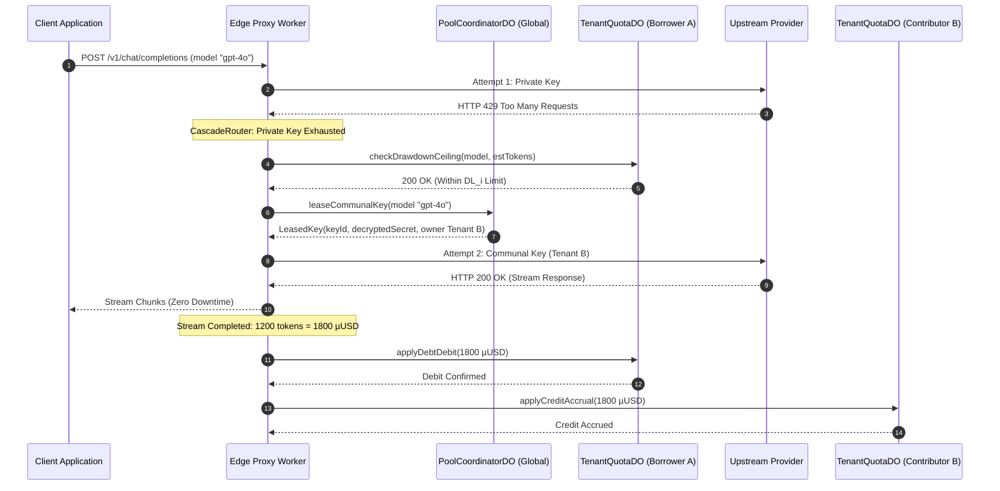

# Chapter 4.2: Communal Failover and Debt Settlement

When a tenant's private capacity is exhausted—or when upstream providers throttle requests with an `HTTP 429 Too Many Requests`—the system transparently transitions from the direct private path to the **Communal Failover & Debt Settlement Pipeline**.

This mechanism is the core economic engine of Key Collective: it transforms stranded communal capacity into zero-downtime execution while strictly enforcing double-entry ledger solvency.

---

## 1. The Communal Failover Topology

The failover lifecycle orchestrates four independent actors across the edge network:
1. **`CascadeRouter`**: Intercepts upstream 429 or 5xx responses and evaluates fallback rules.
2. **`PoolCoordinatorDO`**: The singleton authority managing communal key pools, anti-stampede lease locks, and provider health.
3. **`TenantQuotaDO` (Borrower)**: Tracks debt, verifies drawdown ceilings, and commits debits.
4. **`TenantQuotaDO` (Contributor)**: Accrues reciprocal credit for the tenant whose key serviced the request.



---

## 2. Step-by-Step Failover Trace

### Step 1: 429 Interception & Cascade Evaluation
When the upstream provider returns an HTTP 429 status code, `CascadeRouter` catches the failure. Rather than surfacing an error to the client, the router inspects the tenant's failover policy:

```typescript
// src/router/cascade/router.ts
export class CascadeRouter {
  public async handleUpstreamFailure(
    attempt: RouteAttempt,
    context: RequestContext
  ): Promise<CascadeDecision> {
    if (attempt.status === 429 || attempt.status === 529) {
      // Record failure on private key to trigger local circuit breaker
      await context.keyPoolDO.recordRateLimit(attempt.keyId);

      // Verify whether tenant permits communal pool fallback
      if (context.policy.allowCommunalFallback) {
        return { action: "COMMUNAL_FAILOVER", model: attempt.model };
      }
    }

    return { action: "TERMINATE_WITH_ERROR", error: attempt.error };
  }
}
```

---

### Step 2: Quota & Drawdown Limit Verification
Before leasing communal resources, the borrower's `TenantQuotaDO` must verify that the tenant has not exceeded their **Drawdown Limit ($DL_i$)**:

$$DL_i = \left( \sum_{k \in \text{Keys}(i)} \text{ValidatedCapacity}(k) \right) \times TS_i \times \alpha$$

```typescript
// src/quota/tenant/tenant_do.ts
export class TenantQuotaDO {
  public async canBorrow(estimatedCostMicrodollars: bigint): Promise<boolean> {
    const projectedDebt = this.state.debtMicrodollars + estimatedCostMicrodollars;
    if (projectedDebt > this.state.drawdownLimitMicrodollars) {
      throw new OverdraftLimitExceededError(
        `Tenant ${this.tenantId} exceeded drawdown ceiling: ${projectedDebt} > ${this.state.drawdownLimitMicrodollars}`
      );
    }
    return true;
  }
}
```

If the borrower's net position is beyond the allowed buffer ($\alpha = 0.8$), the request is rejected with `HTTP 429 Too Many Requests (Key Collective: Quota Depleted)`.

---

### Step 3: Anti-Stampede Lease Acquisition
If quota permits, the worker requests a leased key from `PoolCoordinatorDO`. To prevent thundering herds from exhausting a newly available key simultaneously, the coordinator uses short-lived, atomic lease locks:

```typescript
// src/pool/coordinator_do.ts
export class PoolCoordinatorDO {
  public async acquireLease(model: string, tenantId: string): Promise<KeyLease> {
    const candidate = this.communalPool.find(
      (k) => k.model === model && k.ownerTenantId !== tenantId && !k.isLeased
    );

    if (!candidate) {
      throw new CommunalCapacityExhaustedError(`No communal capacity available for ${model}`);
    }

    // Atomic lease acquisition (Survives 15 seconds)
    candidate.isLeased = true;
    candidate.leaseExpiry = Date.now() + 15_000;

    return {
      keyId: candidate.id,
      encryptedSecret: candidate.encryptedKey,
      nonce: candidate.nonce,
      ownerTenantId: candidate.ownerTenantId
    };
  }
}
```

---

### Step 4: Atomic Double-Entry Settlement
Once the stream finishes and the exact token count is calculated by `SSEStreamTransformer`, the settlement transaction executes. 

Key Collective enforces a strict zero-sum conservation law:

$$\Delta \text{Debt}_{\text{Borrower}} + \Delta \text{Credit}_{\text{Contributor}} = 0$$

| Actor | Pre-Transaction Net Position | Transaction Applied | Post-Transaction Net Position |
|---|---|---|---|
| **Borrower A** | $+10,000\text{ µUSD}$ | Debit: $-1,800\text{ µUSD}$ | $+8,200\text{ µUSD}$ |
| **Contributor B** | $-5,000\text{ µUSD}$ | Credit: $+1,800\text{ µUSD}$ | $-3,200\text{ µUSD}$ |
| **System Total** | **$+5,000\text{ µUSD}$** | **$\mathbf{0\text{ µUSD}}$** | **$+5,000\text{ µUSD}$** |

```typescript
// src/quota/tenant/debt.ts
export function executeSettlement(
  borrowerState: TenantState,
  contributorState: TenantState,
  costMicrodollars: bigint
): void {
  borrowerState.debtMicrodollars += costMicrodollars;
  borrowerState.netPositionMicrodollars = 
    borrowerState.creditMicrodollars - borrowerState.debtMicrodollars;

  contributorState.creditMicrodollars += costMicrodollars;
  contributorState.netPositionMicrodollars = 
    contributorState.creditMicrodollars - contributorState.debtMicrodollars;
}
```

---

## 3. Handling Communal Depletion
If the communal pool has no keys available for the requested model tier, `CascadeRouter` performs an **Across-Model Cascade**:
1. It attempts to match a functionally equivalent model (e.g. falling back from `claude-3-5-sonnet` to `gpt-4o`).
2. If cross-model fallback is disabled by tenant configuration, it immediately returns `HTTP 503 Service Unavailable` with a structured `Retry-After: 5` header.

---

## 4. Active Recall Quiz

1. **Q**: What prevents a borrower from endlessly drawing capacity from communal keys?
   <details><summary>Answer</summary>The Drawdown Limit (DL_i), which bounds maximum allowable debt as a function of the validated keys they have contributed, scaled by their Trust Score and risk buffer.</details>

2. **Q**: What is the zero-sum invariant governing double-entry settlement?
   <details><summary>Answer</summary>The change in borrower debt plus the change in contributor credit must exactly equal zero at all times (zero ghost money creation).</details>

3. **Q**: Why are communal leases bounded by a 15-second TTL in PoolCoordinatorDO?
   <details><summary>Answer</summary>To prevent crashed or hanging client requests from permanently locking communal keys away from other tenants (anti-stampede lease expiration).</details>
