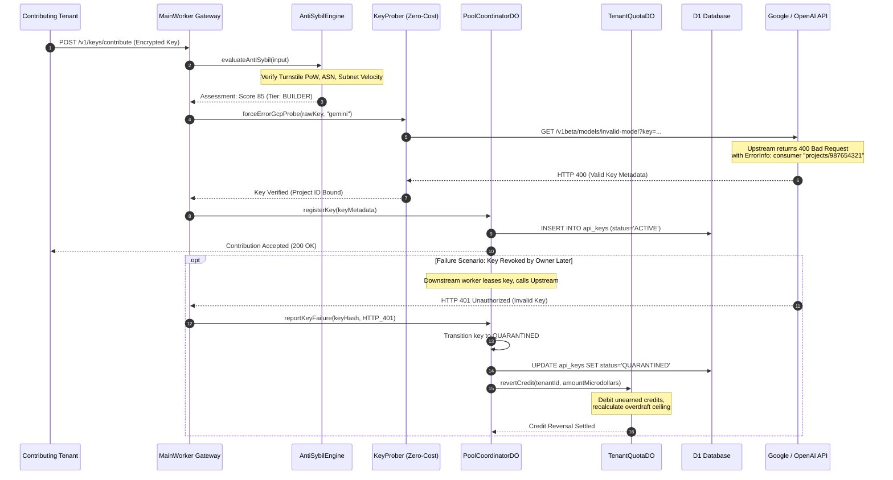

# Chapter 4.3: Anti-Cheat Sentinel, Key Invalidation & Auto-Mediation Flow

In a reciprocal capacity exchange network, the primary existential threat is the **Tragedy of the Commons** driven by bad actors submitting invalid, expired, revoked, or rate-limited API keys to earn illicit communal credits. 

If a tenant submits a dead OpenAI key and immediately consumes communal Anthropic capacity, the network suffers asymmetric depletion. To preserve systemic liquidity and trust, Key Collective deploys an automated, multi-tiered defensive framework: the **Anti-Cheat Sentinel**, **Zero-Cost Error Probing**, and **Automated Dispute Mediation**.

This chapter provides an end-to-end trace of how fraudulent key submissions are detected at ingress, how periodic background health sentinels quarantine toxic credentials, and how the accounting engine programmatically claws back unearned microdollar credits.

---

## 1. Architectural Sentinel Topology

The anti-cheat architecture operates across three distinct operational layers:

1. **Ingress Sybil Evaluation (`AntiSybilEngine`)**: Before an organization or key is accepted into the collective, registration telemetry is evaluated across a 5-layer heuristic engine (Turnstile cryptographic proof-of-work, datacenter ASN inspection, subnet velocity counters, disposable email blocklists, and GitHub reputation scoring).
2. **Synthetic Zero-Cost Key Prober (`ingress/probe.ts`)**: When credentials are submitted or periodically health-checked, the prober issues targeted, error-inducing API calls that validate key authenticity against upstream provider infrastructure without consuming a single token of the user's inference budget.
3. **Transactional Mediation & Clawback (`PoolCoordinatorDO` + `TenantQuotaDO`)**: When an active communal key triggers upstream authorization failures (`401 Unauthorized` or `403 Forbidden`) during live proxying, an automated dispute is logged, the key is transitioned to `QUARANTINED`, and unearned credits are debited from the contributor's ledger.



---

## 2. Step-by-Step Execution Lifecycle

### Step 1: Ingress Registration & 5-Layer Sybil Triage
When a tenant requests admission to communal pooling or submits a newly provisioned key, `evaluateAntiSybil` inspects the request parameters:

```typescript
// src/auth/sybil/engine.ts
export async function evaluateAntiSybil(
  input: AntiSybilInput,
  options: EvaluateAntiSybilOptions = {}
): Promise<AntiSybilAssessment> {
  const auditReasons: string[] = [];

  // Layer 1: Cryptographic Proof-of-Work (Cloudflare Turnstile)
  const turnstileValid = await verifyTurnstileToken(input.turnstileToken, options.turnstileSecret);
  if (!turnstileValid) {
    return { score: 0, tier: "BLOCKED", reasons: ["FAILED_TURNSTILE_POW"] };
  }

  // Layer 2: Network & Subnet Velocity Check
  const subnet = extractSubnet(input.clientIp);
  const subnetCount = await globalSubnetTracker.increment(subnet);
  if (subnetCount > MAX_REGISTRATIONS_PER_SUBNET) {
    return { score: 10, tier: "BLOCKED", reasons: ["SUBNET_VELOCITY_EXCEEDED"] };
  }

  // Layer 3: Datacenter ASN Detection
  if (isDatacenterAsn(input.asn)) {
    auditReasons.push("DATACENTER_IP_DETECTED");
  }

  // Layer 4 & 5: Developer Reputation Scoring
  const score = calculateReputationScore(input, auditReasons);
  const tier = score >= 75 ? "BUILDER" : score >= 40 ? "PROBATIONARY" : "BLOCKED";

  return { score, tier, reasons: auditReasons };
}
```

### Step 2: Zero-Cost Error-Inducing Probing
Traditional key validation requires making a cheap inference call (e.g., `Hello` with `max_tokens: 1`), which wastes the user's quota and costs money. Key Collective introduces **Zero-Cost Error-Inducing Probes**. 

By deliberately querying a non-existent model ID (such as `invalid-model`), the upstream gateway rejects the request at the schema routing layer before invoking model weights, but after performing authentication:

```typescript
// src/ingress/probe.ts
export async function forceErrorGcpProbe(rawKey: string, provider: string): Promise<string | null> {
  if (provider !== "google" && provider !== "gemini") {
    return null;
  }

  try {
    const res = await fetch(
      `https://generativelanguage.googleapis.com/v1beta/models/invalid-model?key=${encodeURIComponent(rawKey)}`
    );
    
    // HTTP 400 indicates the key is valid, but the requested model is invalid
    if (res.status !== 400) {
      return null;
    }

    const data = (await res.json()) as any;
    const details = data?.error?.details;
    if (!Array.isArray(details)) return null;

    const errorInfo = details.find(
      (d: any) => d["@type"] === "type.googleapis.com/google.rpc.ErrorInfo"
    );
    if (errorInfo?.metadata?.consumer) {
      const consumer: string = errorInfo.metadata.consumer;
      if (consumer.startsWith("projects/")) {
        return consumer.substring("projects/".length);
      }
    }
  } catch (err) {
    return null;
  }

  return null;
}
```
If the key was revoked or invalid, the upstream API returns `401 Unauthorized` or `403 Forbidden`, causing the probe to fail immediately without incurring any API usage fees.

### Step 3: Upstream Runtime Anomaly Detection
Even if a key passes ingress verification, the key's owner might revoke it later in their provider dashboard. When a downstream consumer leases this key from `PoolCoordinatorDO` and receives an upstream `401 Unauthorized`, the proxy immediately flags the credential:

```typescript
// src/pool/coordinator_do.ts
export class PoolCoordinatorDO implements DurableObject {
  async handleKeyFailure(keyHash: string, statusCode: number, reason: string): Promise<void> {
    if (statusCode === 401 || statusCode === 403) {
      // Immediate isolation
      await this.quarantineKey(keyHash, reason);
      await this.initiateCreditClawback(keyHash);
    }
  }

  private async quarantineKey(keyHash: string, reason: string): Promise<void> {
    const record = this.inMemoryKeyRegistry.get(keyHash);
    if (record) {
      record.status = "QUARANTINED";
      record.quarantineReason = reason;
      record.quarantinedAt = Date.now();
    }
    
    // Persist to transactional storage and D1
    await this.ctx.storage.put(`key:${keyHash}`, record);
    this.ctx.waitUntil(
      this.env.DB.prepare(
        "UPDATE api_keys SET status = 'QUARANTINED', quarantine_reason = ? WHERE key_hash = ?"
      ).bind(reason, keyHash).run()
    );
  }
}
```

### Step 4: Automated Credit Clawback & Ledger Settlement
To ensure bad actors cannot profit from submitting dead keys, the `TenantQuotaDO` executes an atomic credit rollback:

```typescript
// src/quota/tenant/debt.ts
export function executeCreditClawback(
  currentBalanceMicrodollars: number,
  fraudulentEarningsMicrodollars: number,
  penaltyMultiplier: number = 1.5
): { newBalance: number; penaltyCharged: number } {
  const penaltyCharged = Math.floor(fraudulentEarningsMicrodollars * penaltyMultiplier);
  const newBalance = currentBalanceMicrodollars - penaltyCharged;
  return { newBalance, penaltyCharged };
}
```

---

## 3. Failure Modes & Defensive Invariants

| Failure Vector | Detection Window | Mitigation Action | Economic Impact |
|---|---|---|---|
| **Revoked Key Injection** | < 200ms (Synthetic Probe) | Ingress Rejection | Zero credit issued |
| **Mid-Lease Key Revocation** | Immediate on 401 response | Instant Quarantine + Clawback | 150% credit clawback penalty |
| **Subnet Sybil Syphon** | 60s sliding window | Turnstile PoW Challenge + ASN block | IP ban across Cloudflare Edge |
| **Model Capability Spoofing** | First inference attempt | Route downgrade + key isolation | Key evicted from communal catalog |

---

## 4. Self-Check Active Recall Quiz

1. **Question:** Why does Key Collective's prober deliberately request `/models/invalid-model` during GCP key verification instead of a valid endpoint?
<details>
<summary>Click to reveal answer</summary>
Querying an invalid model forces Google's API to authenticate the key and return an HTTP 400 Bad Request with the GCP project metadata in <code>google.rpc.ErrorInfo</code>, proving the key is authentic without spending any inference tokens or incurring financial charges.
</details>

2. **Question:** What happens to a contributing tenant's credit ledger if a shared key fails with a 401 Unauthorized during another tenant's inference?
<details>
<summary>Click to reveal answer</summary>
The <code>PoolCoordinatorDO</code> immediately moves the key to <code>QUARANTINED</code>, removes it from the active routing mesh, and triggers an RPC call to the contributor's <code>TenantQuotaDO</code> to claw back earned microdollar credits plus a penalty multiplier.
</details>
