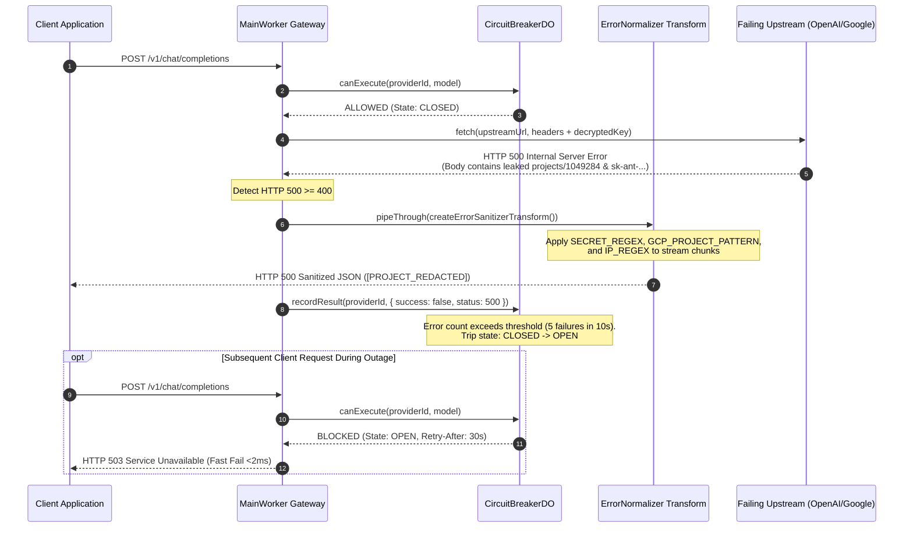

# Chapter 4.4: Zero-Leak Error Sanitization, Upstream Outages & Emergency Brake

In a multi-tenant LLM proxy, upstream failures are inevitable: upstream providers experience cascading database deadlocks (`500 Internal Server Error`), capacity saturation (`529 Overloaded`), routing misconfigurations (`502 Bad Gateway`), or regional outages (`503 Service Unavailable`).

However, passing raw upstream error responses directly to client applications violates two critical security invariants:
1. **Secret & Metadata Leakage**: Upstream providers frequently leak raw bearer tokens, internal Google Cloud project IDs (`projects/123456789`), billing accounts, and private IP addresses in their error payloads.
2. **Cascading Edge Saturation**: When an upstream provider goes down, naive proxies continue forwarding thousands of client requests into dead sockets, exhausting edge concurrency limits and burning tenant latency budgets.

This chapter traces the complete defensive lifecycle: from streaming regex sanitization in `src/worker/error_normalizer.ts` to the automated trip mechanics of `CircuitBreakerDO`.

---

## 1. Architectural Error Pipeline

When an upstream request fails or throws an exception, it enters a rigorous defensive perimeter:

1. **Header Allow-list Filter**: Upstream response headers are stripped of all proprietary metadata, retaining only safe RFC standard headers and Key Collective observability headers (`x-kc-request-id`, `x-kc-provider`).
2. **Streaming Error Normalizer**: If the HTTP status is $\ge 400$, the response body is piped through a `TransformStream` that applies compiled regular expressions to redact secrets, GCP project numbers, billing accounts, and IP addresses in real time.
3. **Emergency Brake (Circuit Breaker)**: High-frequency 5xx errors trigger the `CircuitBreakerDO` actor. When the error threshold is breached, the circuit transitions from `CLOSED` to `OPEN`, short-circuiting downstream calls and serving instantaneous local fallbacks without touching the failing provider.



---

## 2. Step-by-Step Execution Lifecycle

### Step 1: Header Sanitization and Allow-Listing
Upstream providers often return internal gateway headers, cloud trace context, or internal server routing tags. Key Collective enforces a strict allow-list policy:

```typescript
// src/worker/error_normalizer.ts
export const ALLOWED_RESPONSE_HEADERS: ReadonlySet<string> = new Set([
  "content-type",
  "content-length",
  "cache-control",
  "x-ratelimit-limit-requests",
  "x-ratelimit-remaining-requests",
  "x-ratelimit-reset-requests",
  "x-request-id",
  "x-kc-request-id",
  "x-kc-model-used",
  "x-kc-provider",
  "x-kc-trace-id",
  "transfer-encoding",
  "content-encoding",
]);

export function sanitizeResponseHeaders(upstreamHeaders: Headers): Headers {
  const clean = new Headers();
  for (const [key, value] of upstreamHeaders.entries()) {
    if (ALLOWED_RESPONSE_HEADERS.has(key.toLowerCase())) {
      clean.set(key, value);
    }
  }
  return clean;
}
```

### Step 2: Streaming Body Redaction
If an upstream error body contains sensitive system identifiers or accidental token dumps, `createErrorSanitizerTransform` intercepts the byte stream and sanitizes the payload without buffering the entire body into memory:

```typescript
// src/worker/error_normalizer.ts
const GCP_PROJECT_PATTERN = /projects\/\d{6,12}/gi;
const BILLING_ACCOUNT_PATTERN = /billingAccounts\/[A-Z0-9-]{6,}/gi;
const CLOUD_TRACE_PATTERN = /\b[0-9a-f]{32}\/\d+\b/gi;
export const SECRET_REGEX = /(sk-[a-zA-Z0-9]{20,}|Bearer\s+[a-zA-Z0-9\-\._~+\/]+)/g;
export const IP_REGEX = /\b(?:\d{1,3}\.){3}\d{1,3}\b/g;

export function sanitizeErrorBody(raw: string): string {
  return raw
    .replace(GCP_PROJECT_PATTERN, "[PROJECT_REDACTED]")
    .replace(BILLING_ACCOUNT_PATTERN, "[BILLING_REDACTED]")
    .replace(CLOUD_TRACE_PATTERN, "[TRACE_REDACTED]")
    .replace(SECRET_REGEX, "[REDACTED_SECRET]")
    .replace(IP_REGEX, "[REDACTED_IP]");
}

export function createErrorSanitizerTransform(): TransformStream<Uint8Array | string, Uint8Array> {
  const decoder = new TextDecoder();
  const encoder = new TextEncoder();
  return new TransformStream<Uint8Array | string, Uint8Array>({
    transform(chunk: Uint8Array | string, controller: TransformStreamDefaultController<Uint8Array>) {
      const text = typeof chunk === "string" ? chunk : decoder.decode(chunk, { stream: true });
      const sanitized = sanitizeErrorBody(text);
      controller.enqueue(encoder.encode(sanitized));
    },
    flush(controller: TransformStreamDefaultController<Uint8Array>) {
      const remaining = decoder.decode();
      if (remaining) {
        controller.enqueue(encoder.encode(sanitizeErrorBody(remaining)));
      }
    },
  });
}
```

### Step 3: Circuit Breaker State Transitions
When upstream errors breach acceptable tolerances, `CircuitBreakerDO` trips into the `OPEN` state, halting the thundering herd and protecting edge CPU resources:

```typescript
// src/durable_objects/circuit_breaker/breaker.ts
export class CircuitBreaker {
  private state: "CLOSED" | "OPEN" | "HALF_OPEN" = "CLOSED";
  private failureCount: number = 0;
  private lastFailureTime: number = 0;
  private readonly threshold: number = 5;
  private readonly resetTimeoutMs: number = 30_000; // 30s cooldown

  canExecute(): boolean {
    const now = Date.now();
    if (this.state === "OPEN") {
      if (now - this.lastFailureTime > this.resetTimeoutMs) {
        this.state = "HALF_OPEN";
        return true; // Probe execution allowed
      }
      return false; // Fast rejection
    }
    return true;
  }

  recordSuccess(): void {
    if (this.state === "HALF_OPEN") {
      this.state = "CLOSED";
      this.failureCount = 0;
    }
  }

  recordFailure(): void {
    this.failureCount++;
    this.lastFailureTime = Date.now();
    if (this.failureCount >= this.threshold) {
      this.state = "OPEN";
    }
  }
}
```

---

## 3. Failure Modes & Invariant Guarantees

| Invariant | Implementation Mechanism | Violation Consequence |
|---|---|---|
| **Zero Secret Leakage** | `SECRET_REGEX` text stream filtering | Upstream keys exposed to untrusted clients |
| **Cloud Project Obfuscation** | `GCP_PROJECT_PATTERN` redaction | Attacker discovers backend infrastructure account IDs |
| **Fast-Fail Recovery (<2ms)** | In-memory `CircuitBreakerDO.canExecute()` check | Requests stall for 30s waiting on dead upstream sockets |
| **Non-Blocking Telemetry** | `ctx.waitUntil(emitWAEEvent())` | Telemetry I/O delays error return to client |

---

## 4. Self-Check Active Recall Quiz

1. **Question:** Why does Key Collective remove the `content-length` header when piping an upstream error through `createErrorSanitizerTransform`?
<details>
<summary>Click to reveal answer</summary>
Because replacing sensitive patterns (such as redacting a 12-digit project ID with <code>[PROJECT_REDACTED]</code>) alters the total byte length of the body. Keeping the original <code>content-length</code> header would cause HTTP protocol truncation or socket hangs.
</details>

2. **Question:** What is the operational behavior of the proxy when a provider circuit breaker is in the <code>OPEN</code> state?
<details>
<summary>Click to reveal answer</summary>
The proxy immediately rejects requests for that provider locally in under 2ms with an HTTP 503 Service Unavailable and a <code>Retry-After</code> header, preventing thundering herds from saturating edge isolates.
</details>
