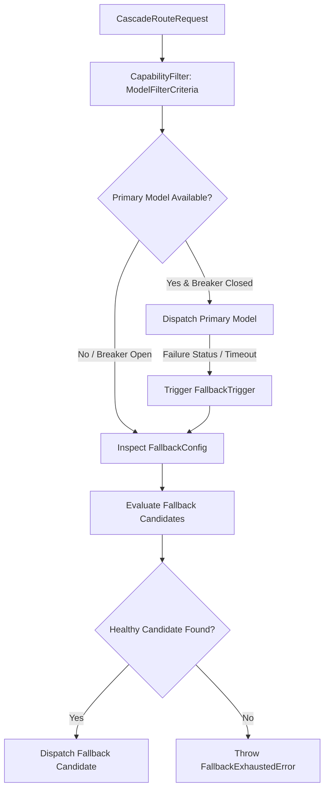

# 05: Idioms, Patterns, and Trade-offs

Every codebase exhibits a distinct engineering vernacular—an idiomatic architecture that governs how distributed state is partitioned, how errors are classified, and how failures cascade. Conforming to this vernacular ensures consistency, resilience, and operational simplicity at the edge.

This chapter documents the core design patterns, comprehensive error taxonomy, and deliberate trade-offs of Key Collective.

---

## 1. Domain Error Hierarchy & Zero-Tautology Invariant

A central idiom in Key Collective is **Zero-Tautology Error Messages**. Throwing generic errors like `new Error("Failed to route")` or `new Error("Provider error")` is strictly prohibited. Every error must specify:
1. The **exact system invariant** that was breached.
2. The **operational context** (e.g. `tenantId`, `provider`, `modelAlias`, `costMicrodollars`).
3. The **recommended resolution** for the caller.

All custom errors inherit from a standardized base that renders to `DomainErrorJson` (configured via `DomainErrorOptions`).

### 1.1 Routing & Provider Error Taxonomy

```typescript
// src/errors/routing_errors.ts & src/errors/model_errors.ts
export interface ProviderRoutingErrorOptions extends DomainErrorOptions {
  provider: string;
  statusCode?: number;
  reason?: string;
}

export class ProviderRoutingError extends DomainError {
  constructor(message: string, options: ProviderRoutingErrorOptions) {
    super(message, options);
  }
}

export interface ProviderTimeoutErrorOptions extends DomainErrorOptions {
  provider: string;
  timeoutMs: Milliseconds;
}

export class ProviderTimeoutError extends DomainError {
  constructor(message: string, options: ProviderTimeoutErrorOptions) {
    super(message, options);
  }
}

export interface NoAvailableProviderErrorOptions extends DomainErrorOptions {
  modelAlias: string;
  attemptedProviders: string[];
}

export class NoAvailableProviderError extends DomainError {
  constructor(message: string, options: NoAvailableProviderErrorOptions) {
    super(message, options);
  }
}

export interface RouterErrorOptions extends DomainErrorOptions {
  route: string;
}

export class RouterError extends DomainError {
  constructor(message: string, options: RouterErrorOptions) {
    super(message, options);
  }
}
```

When an alias cannot be resolved, an `UnknownModelAliasError` (with `UnknownModelAliasErrorOptions`) or `ModelNotFoundError` (with `ModelNotFoundErrorOptions`) is raised, referencing the canonical `KnownModelAlias` or `KnownModelProvider` catalog.

### 1.2 Capacity, Rate Limiting & Circuit Breaker Errors

When upstream capacity is exhausted:
- If all API keys in the tenant pool have exceeded RPM/TPM limits, the engine throws `KeyExhaustedError` (with `KeyExhaustedErrorOptions`) or `KeyNotFoundError` (with `KeyNotFoundErrorOptions`).
- When a key violates formatting or tenant boundaries, `InvalidKeyError` (with `InvalidKeyErrorOptions`) is thrown.
- If upstream error rates cross the threshold, the circuit breaker opens, throwing `CircuitBreakerTrippedError` (with `CircuitBreakerTrippedErrorOptions`).
- If a tenant exceeds their allotted quota or attempts cross-tenant tampering, the engine throws `QuotaExceededError` (with `QuotaExceededErrorOptions`), `TenantIsolationError` (with `TenantIsolationErrorOptions`), or `TenantIsolationViolationError`.
- For token authorization failures, the auth gate produces `AuthenticationError` (with `AuthenticationErrorOptions`), returning an `AuthMiddlewareFailure` instead of an `AuthMiddlewareSuccess`.

### 1.3 Capability & Context Window Validation

Before dispatching an inference call, the `CapabilityFilter` validates that the candidate model satisfies the prompt's requirements:

```typescript
// src/router/capability/types.ts
export interface CapabilityRequirements {
  requiresVision?: boolean;
  requiresTools?: boolean;
  requiresJsonSchema?: boolean;
  minContextWindow?: number;
}

export interface CapabilityCheckResult {
  capable: boolean;
  missingCapabilities: string[];
}

export interface ContextValidationResult {
  valid: boolean;
  estimatedTokens: number;
  maxTokensAllowed: number;
}
```

If a candidate model lacks required multi-modal or tool features, the router throws `CapabilityMismatchError` (with `CapabilityMismatchErrorOptions`). If prompt tokens exceed the model's physical window, `ContextWindowExceededError` (with `ContextWindowExceededErrorOptions`) prevents downstream provider rejection.

---

## 2. Dynamic Fallback Cascades & Resilience Patterns

The cascade routing pattern provides seamless failover across diverse providers without requiring client retries.



### 2.1 Fallback Configuration Contracts

```typescript
// src/router/cascade/types.ts
export interface FallbackConfig {
  maxAttempts: number;
  candidateModels: readonly string[];
  triggers: readonly FallbackTrigger[];
  allowDegradedFallback?: boolean;
}

export interface FallbackExhaustedErrorOptions extends DomainErrorOptions {
  requestedModel: string;
  attempts: FallbackAttempt[];
}

export class FallbackExhaustedError extends DomainError {
  constructor(message: string, options: FallbackExhaustedErrorOptions) {
    super(message, options);
  }
}
```

Fallback triggers include `"rate_limit"`, `"circuit_breaker_open"`, and `"upstream_error"`. If all candidates in the chain fail, `FallbackExhaustedError` is returned with full audit telemetry.

### 2.2 Circuit Breaker & Rate Limiter Configuration

Circuit breakers and rate limiters operate transactionally inside Durable Objects:

```typescript
// src/durable_objects/circuit_breaker/types.ts & rate_limiter/types.ts
export interface CircuitBreakerConfig {
  failureThreshold: number;
  recoveryTimeMs: number;
  sampleWindowMs: number;
}

export interface CircuitBreakerOptions {
  config?: CircuitBreakerConfig;
  storage?: DurableObjectStorageLike;
  timeProvider?: () => number;
}

export interface RateLimitConfig {
  rpm: number;
  tpm?: number;
  windowSeconds: number;
}

export interface RateLimitEntry {
  timestamp: number;
  tokens: number;
}

export interface RateLimitCheckResult {
  allowed: boolean;
  remainingRpm: number;
  retryAfterSeconds?: number;
}

export interface RateLimiterData {
  entries: RateLimitEntry[];
  lastRefillTimestamp: number;
}

export interface RateLimiterMetrics {
  currentRpm: number;
  peakRpm: number;
  totalRequests: number;
}

export interface RateLimiterOptions {
  config: RateLimitConfig;
  storage?: DurableObjectStorageLike;
}
```

Administrators can dynamically reset or override trips via `ProviderCircuitOverridePayload`.

---

## 3. Storage Repositories & Accounting Ledger

Persistent database operations follow repository patterns that abstract Cloudflare D1 SQL queries into type-safe domain collections.

### 3.1 Authentication & Credential Repositories

```typescript
// src/storage/repositories/
export interface AuthTokenRepositoryConfig {
  db: D1Database;
  tableName?: string;
}

export interface AuthTokenRecord {
  tokenHash: string;
  tenantId: string;
  tier: string;
  createdAtUtc: string;
  expiresAtUtc?: string | null;
}

export interface AuthTokenRow {
  token_hash: string;
  tenant_id: string;
  tier: string;
  created_at_utc: string;
  expires_at_utc?: string | null;
}

export interface APIKeyRow {
  key_id: string;
  tenant_id: string;
  provider: string;
  ciphertext: string;
  nonce: string;
  tag: string;
}

export interface ApiKeyRepository {
  createKey(input: CreateApiKeyInput): Promise<void>;
  updateKey(input: UpdateApiKeyInput): Promise<void>;
}

export interface ApiKeysRepository extends ApiKeyRepository {}
```

### 3.2 Cost Accounting & Community Debt Ledger

Financial accounting records every completion event immutably:

```typescript
// src/storage/repositories/cost_ledger/types.ts & src/quota/tenant/types.ts
export interface CostBreakdown {
  promptTokens: number;
  completionTokens: number;
  promptCostMicrodollars: bigint;
  completionCostMicrodollars: bigint;
  totalCostMicrodollars: bigint;
}

export interface CostLedgerEvent {
  eventId: string;
  tenantId: string;
  model: string;
  provider: string;
  breakdown: CostBreakdown;
  timestamp: number;
}

export interface CommunityDebtLedger {
  tenantId: string;
  contributedTokensMicrodollars: bigint;
  consumedTokensMicrodollars: bigint;
  netStandingMicrodollars: bigint;
  standingTier: 'CREDITOR' | 'BALANCED' | 'DEBTOR' | 'RESTRICTED';
}
```

If an invalid cost event is ingested (e.g. negative microdollar amounts), `InvalidCostLedgerEventError` is thrown, halting database corruption.

---

## 4. Frontend UI State & Developer Workbench Types

The web dashboard and interactive documentation interface (`ui/src/lib/`) utilize strict types for client-side state:

```typescript
// ui/src/lib/types.ts
export interface ModalState {
  isOpen: boolean;
  mode: 'create' | 'edit' | 'delete';
  keyId?: string;
}

export interface KeyFormData {
  label: string;
  provider: string;
  rawKey: string;
  rpmLimit: number;
}

export interface ToastMessage {
  id: string;
  type: 'success' | 'warning' | 'error' | 'info';
  message: string;
}

export interface ModelOption {
  id: string;
  provider: string;
}

export interface ModelPricingItem {
  id: string;
  owned_by: string;
  routing_engine: string;
  inputCost1kMicro: number;
  outputCost1kMicro: number;
  bulletClass: string;
  isDeprecated: boolean;
}

export interface WorkbenchProps {
  initialTenantId: string;
  projects: Project[];
  activeProject?: ExtendedProject;
}

export interface Project {
  id: string;
  name: string;
  createdAt: string;
}

export interface ExtendedProject extends Project {
  apiKeysCount: number;
  totalSpendMicrodollars: bigint;
}

export interface MaskedKeyParts {
  prefix: string;
  maskedMiddle: string;
  suffix: string;
}

export type Milliseconds = number;
```

---

## 5. Architectural Trade-offs Matrix

| Architectural Decision | Advantages Gained | Incurred Cost / Trade-off |
| :--- | :--- | :--- |
| **In-Memory DO Actor State vs Global Redis** | Zero-latency reads, linearizable per-tenant consistency, no cross-region network hops. | Concurrency is bounded to a single DO instance per tenant. High parallelism requires sharding. |
| **D1 SQLite vs External PostgreSQL** | Zero connection pool exhaustion, native edge binding, zero maintenance overhead. | Write operations serialize through primary region, creating slight write latency for bulk ledger writes. |
| **Fixed-Point Microdollars vs IEEE Floats** | Absolute mathematical precision, zero drift across millions of transactions, audit certainty. | Requires BigInt serialization logic when persisting to JSON/SQL, preventing direct float math. |
| **Edge Stream Interception vs Buffering** | Ultra-low TTFT, bounded worker memory consumption, smooth streaming UX. | Usage metadata extraction must inspect raw SSE stream frames dynamically before connection closes. |
