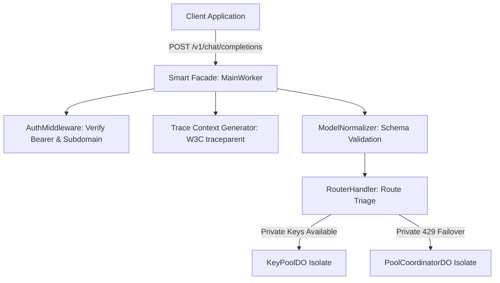

# Chapter 5.1: Architectural Patterns in Edge Systems

Building distributed systems across serverless edge environments like Cloudflare Workers and Durable Objects introduces architectural constraints fundamentally distinct from traditional Node.js or Kubernetes container clusters. Edge isolates operate with near-zero cold starts (<5ms), strict memory ceilings (128MB), and stateless ephemeral lifecycles distributed across 300+ global Points of Presence (PoPs).

To achieve high throughput, multi-tenant fairness, and cryptographic safety under these constraints, Key Collective relies on four architectural patterns:
1. **The Smart Facade Pattern** (Perimeter Ingress & Protocol Normalization)
2. **The Distributed Actor Mesh Pattern** (Single-Threaded Consistency via Durable Objects)
3. **The Defensive Perimeter Pattern** (Zero-Trust Boundary Filtering & Data Masking)
4. **The Backpressure-Aware Streaming Pipeline** (Zero-Buffer SSE Chaining)

---

## 1. The Smart Facade Pattern

In an API proxy, downstream clients expect standard OpenAI-compatible endpoints (`/v1/chat/completions`), while upstream model providers utilize diverse URL schemas, proprietary authentication schemes, and incompatible JSON envelopes.

The **Smart Facade Pattern** encapsulates this diversity at the edge gateway layer (`MainWorker` and `RouterHandler`):
- **Protocol Normalization**: Parses incoming OpenAI-compatible request payloads into typed internal domain objects (`ModelRequest`).
- **Context Enrichment**: Injects caller identity, tenant credentials, security tier, and distributed trace headers (`x-kc-request-id`, `x-kc-trace-id`) without exposing internal architecture to callers.
- **Route Triage**: Determines whether a request can be satisfied via the caller's private key isolate or requires routing to the communal coordinator.



The Smart Facade acts as an insulating layer. If an upstream provider modifies its authentication protocol or deprecates an API version, only the facade translation layer changes; internal routing, accounting, and quota logic remain untouched.

---

## 2. The Distributed Actor Mesh Pattern

In a system deployed across 300+ edge locations worldwide, maintaining synchronized state using centralized databases or distributed Redis clusters is impractical: network round-trips add 80–150ms of cross-continental latency and create single points of failure.

Key Collective adopts Cloudflare's **Durable Objects** to implement the **Distributed Actor Mesh**:
- **Point-of-Single-Truth**: Each tenant is assigned dedicated actor isolates: `KeyPoolDO` manages credentials and rate limits, while `TenantQuotaDO` manages financial balances and debt ceilings.
- **Single-Threaded Determinism**: Durable Objects process incoming RPC invocations sequentially on a single-threaded V8 event loop. This guarantees that sliding-window rate counters and debt balance mutations execute without race conditions or distributed locking overhead.
- **Transactional Edge Storage**: State modifications reside in fast in-memory heap structures and are persisted transactionally to disk via `this.ctx.storage.put()`, surviving isolate eviction.

```typescript
// src/durable_objects/base_actor.ts
export abstract class BaseEdgeActor implements DurableObject {
  protected ctx: DurableObjectState;
  protected env: Env;

  constructor(ctx: DurableObjectState, env: Env) {
    this.ctx = ctx;
    this.env = env;
  }

  // Serialized execution ensures race-free state transitions
  abstract fetch(request: Request): Promise<Response>;

  protected async persistState<T>(key: string, value: T): Promise<void> {
    await this.ctx.storage.put(key, value);
  }
}
```

By partitioning state into fine-grained actors per tenant, Key Collective scales horizontally without cross-tenant contention or lock degradation.

---

## 3. The Defensive Perimeter Pattern

The **Defensive Perimeter Pattern** establishes zero-trust boundaries at both ingress and egress interfaces of the proxy:
1. **Ingress Boundary**: Rejects unauthorized requests, throttled tenants, or abusive automated botnets before touching internal Durable Objects or invoking upstream APIs.
2. **Egress Boundary**: Strips internal provider headers, hop-by-hop metadata, and proprietary tracking headers using `sanitizeResponseHeaders()`.
3. **Data Masking Boundary**: Passes upstream error bodies through a streaming regex transform to prevent leaking secret keys, billing account numbers, internal IP addresses, or Google Cloud project numbers.

```typescript
// src/worker/error_normalizer.ts
export function createDefensivePerimeter(upstream: Response): Response {
  const cleanHeaders = sanitizeResponseHeaders(upstream.headers);
  let body = upstream.body;

  // Mask sensitive metadata on all 4xx/5xx error streams
  if (upstream.status >= 400 && body) {
    body = body.pipeThrough(createErrorSanitizerTransform());
  }

  return new Response(body, {
    status: upstream.status,
    statusText: upstream.statusText,
    headers: cleanHeaders,
  });
}
```

---

## 4. The Backpressure-Aware Streaming Pipeline

Generative LLMs produce responses as Server-Sent Events (SSE) over HTTP streams. Buffering an entire 4,000-token stream in isolate memory causes two critical failures:
1. **Memory Ceiling Violation**: High-frequency concurrent requests accumulate buffered chunks, breaching the 128MB V8 isolate heap limit and triggering immediate crashes.
2. **Latency Degradation**: Buffering prevents incremental token delivery, spiking Time to First Token (TTFT) from 500ms to several seconds.

Key Collective utilizes the Web Streams API to implement a **Backpressure-Aware Streaming Pipeline**:
- The upstream response body is piped directly into a `TransformStream` that parses chunks, calculates token consumption, and forwards the byte stream directly to the client's HTTP response.
- If a downstream client experiences network congestion, the browser's TCP window shrinks, exerting natural backpressure through the `TransformStream` back to the upstream HTTP connection. RAM utilization remains strictly bounded at $O(1)$.

```typescript
// src/proxy/sse/transformer.ts
export function createStreamingPipeline(
  upstreamStream: ReadableStream<Uint8Array>,
  onUsageExtracted: (usage: TokenUsage) => void
): ReadableStream<Uint8Array> {
  const textDecoder = new TextDecoder();
  const textEncoder = new TextEncoder();

  return upstreamStream.pipeThrough(
    new TransformStream<Uint8Array, Uint8Array>({
      transform(chunk, controller) {
        // Transparent chunk pass-through with minimal memory overhead
        controller.enqueue(chunk);
        
        const text = textDecoder.decode(chunk, { stream: true });
        if (text.includes('"usage":')) {
          const usage = parseUsagePayload(text);
          if (usage) onUsageExtracted(usage);
        }
      },
    })
  );
}
```

---

## 5. Architectural Pattern Summary Matrix

| Pattern | Primary Responsibility | Critical Invariant Protected | Key Code Artifact |
|---|---|---|---|
| **Smart Facade** | Protocol adaptation & context injection | Uniform client interface | `src/worker/router/router_handler.ts` |
| **Distributed Actor Mesh** | Single-threaded state & ledger mutations | Race-free communal accounting | `src/durable_objects/key_pool_do.ts` |
| **Defensive Perimeter** | Zero-trust header & body sanitization | Zero secret/metadata leakage | `src/worker/error_normalizer.ts` |
| **Streaming Pipeline** | Zero-copy backpressure token delivery | $O(1)$ memory consumption | `src/proxy/sse/transformer.ts` |

---

## 6. Self-Check Active Recall Quiz

1. **Question:** Why is a distributed Redis lock undesirable for coordinating key allocations across Cloudflare's global edge network?
<details>
<summary>Click to reveal answer</summary>
A centralized Redis cluster introduces 80–150ms of cross-continental network latency on every request and represents a single point of failure. Durable Objects provide localized single-threaded event loops, ensuring linearizable consistency at sub-millisecond speeds without distributed locks.
</details>

2. **Question:** How does the Backpressure-Aware Streaming Pipeline prevent out-of-memory errors when a client on a slow 3G connection receives a large stream?
<details>
<summary>Click to reveal answer</summary>
It connects upstream and downstream sockets directly via a <code>TransformStream</code>. When the client's TCP receive buffer fills, backpressure automatically halts reads from the upstream provider, bounding isolate memory consumption to a few kilobytes regardless of stream size.
</details>
