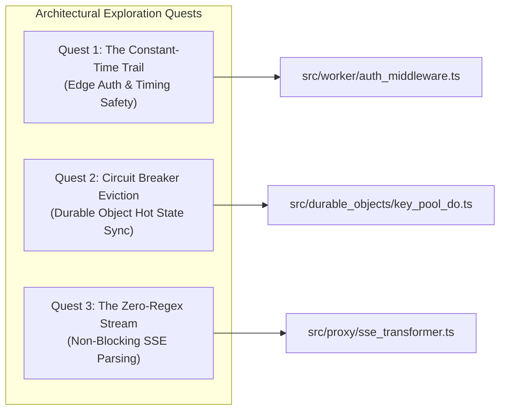

# Part 6: Hands-On Lab Challenges & Quizzes

> **Socratic Quizmaster Directive:** True systems fluency is not acquired by passive reading; it is forged through active codebase investigation, rigorous architectural interrogation, and safe hands-on mutation. This chapter presents three investigative exploration quests, a five-part architectural defense exam, and a graduation coding laboratory.

---

## 🎯 Section 1: Codebase Treasure Hunts (Exploration Quests)

Embark on these three investigative quests through the [`Key Collective`](file:///home/akshit/Projects/Key%20Collective) codebase. Inspect the actual source implementations to uncover how distributed invariants and cryptographic boundaries are maintained in production.



---

### 🕵️‍♂️ Quest 1: Track Bearer Token Authentication Down to Constant-Time Comparison

* **Mission:** When a client sends an HTTP request to the Cloudflare Worker edge, a timing attack could theoretically allow an adversary to deduce secret token characters by observing nanosecond variations in CPU string comparison loops. Trace the request from the raw HTTP header down to the bitwise comparison.
* **Navigation Targets:**
  1. Open [`auth_middleware.ts`](file:///home/akshit/Projects/Key%20Collective/src/worker/auth_middleware.ts) and locate [`extractBearerToken()`](file:///home/akshit/Projects/Key%20Collective/src/worker/auth_middleware.ts#L212-L256). Notice how it validates the Authorization header format against the scheme regex `/^bearer\s*(.*)$/i` before returning the sanitized token string.
  2. Inspect [`AuthMiddleware.authenticate()`](file:///home/akshit/Projects/Key%20Collective/src/worker/auth_middleware.ts#L442-L601). Observe how [`AuthMiddleware`](file:///home/akshit/Projects/Key%20Collective/src/worker/auth_middleware.ts#L340) resolves the repository via [`resolveAuthTokensRepository()`](file:///home/akshit/Projects/Key%20Collective/src/worker/auth_middleware.ts#L301-L333) and invokes `repo.findByToken(rawToken)`.
  3. Navigate to [`authTokens.ts`](file:///home/akshit/Projects/Key%20Collective/src/storage/repositories/authTokens.ts#L334-L353). In `AuthTokensRepository.findByToken()`, observe the critical architectural invariant: plaintext tokens are never stored in D1. The repository hashes the candidate token using SHA-256 (`hashToken(plainToken)`), queries D1 for `WHERE hash_sha256 = ? LIMIT 1`, and then executes a timing-safe verification.
  4. Follow the call to [`timingSafeEqualStrings()`](file:///home/akshit/Projects/Key%20Collective/src/crypto/utils.ts#L51-L56) in [`src/crypto/utils.ts`](file:///home/akshit/Projects/Key%20Collective/src/crypto/utils.ts#L1).
  5. Inspect the core bitwise loop in [`timingSafeEqual()`](file:///home/akshit/Projects/Key%20Collective/src/crypto/utils.ts#L25-L41):

```typescript
export function timingSafeEqual(a: Uint8Array, b: Uint8Array): boolean {
  if (a.byteLength !== b.byteLength) {
    // Constant-time dummy pass to normalize execution timing across mismatched lengths
    let dummy = a.byteLength ^ b.byteLength;
    for (let i = 0; i < a.byteLength; i++) {
      dummy |= a[i] ^ a[i];
    }
    return false;
  }

  let diff = 0;
  for (let i = 0; i < a.byteLength; i++) {
    diff |= a[i] ^ b[i];
  }

  return diff === 0;
}
```

* **Socratic Reflection:**
  * Why does [`timingSafeEqual()`](file:///home/akshit/Projects/Key%20Collective/src/crypto/utils.ts#L25-L41) execute a dummy loop over buffer `a` when lengths differ instead of returning immediately?
  * What would happen if an early `return false` were executed upon the first byte mismatch? How many requests would an attacker need to isolate a 32-byte secret token?

---

### 🕵️‍♂️ Quest 2: Trace How KeyPoolDO Manages Circuit Breaker Cooldown & Durable Object Storage

* **Mission:** Cloudflare Durable Objects may hibernate or be evicted from edge isolate memory during periods of low traffic. In-memory timers (`setTimeout` or background polling threads) cannot survive isolate termination. Trace how [`KeyPoolDO`](file:///home/akshit/Projects/Key%20Collective/src/durable_objects/key_pool_do.ts#L110) and [`CircuitBreaker`](file:///home/akshit/Projects/Key%20Collective/src/durable_objects/circuit_breaker.ts#L151) ensure that provider failure counts and cooldown timestamps survive eviction without relying on background loops.
* **Navigation Targets:**
  1. Open [`key_pool_do.ts`](file:///home/akshit/Projects/Key%20Collective/src/durable_objects/key_pool_do.ts) and locate the constructor of [`KeyPoolDO`](file:///home/akshit/Projects/Key%20Collective/src/durable_objects/key_pool_do.ts#L125-L178). Notice that [`CircuitBreaker`](file:///home/akshit/Projects/Key%20Collective/src/durable_objects/circuit_breaker.ts#L151) is instantiated with `this.ctx.storage` (the Durable Object transactional storage interface).
  2. Inspect [`KeyPoolDO.recordResult()`](file:///home/akshit/Projects/Key%20Collective/src/durable_objects/key_pool_do.ts#L488-L516) and [`KeyPoolDO.recordStatusCode()`](file:///home/akshit/Projects/Key%20Collective/src/durable_objects/key_pool_do.ts#L519-L542). Notice that status codes (`429`, `500`, `502`, `503`, `504`) are forwarded directly to `this.circuitBreaker.recordStatusCode(keyId, statusCode)`.
  3. Open [`circuit_breaker.ts`](file:///home/akshit/Projects/Key%20Collective/src/durable_objects/circuit_breaker.ts#L379-L409) and inspect `recordFailure()`. Notice how tripping the breaker sets `data.state = "OPEN"` and records `data.openedAt = currentTime`, followed immediately by `await this.persist(id, data)`, writing `{ ...data }` to `this.storage.put("cb:" + id, data)`.
  4. Now look at [`evaluateCooldown()`](file:///home/akshit/Projects/Key%20Collective/src/durable_objects/circuit_breaker.ts#L213-L226) and [`getData()`](file:///home/akshit/Projects/Key%20Collective/src/durable_objects/circuit_breaker.ts#L232-L254):

```typescript
private evaluateCooldown(data: CircuitBreakerData): boolean {
  if (data.state === "OPEN" && data.openedAt !== null) {
    const elapsed = this.now() - data.openedAt;
    if (elapsed >= this.cooldownMs) {
      data.state = "HALF_OPEN";
      data.consecutiveSuccesses = 0;
      return true;
    }
  }
  return false;
}
```

* **Socratic Reflection:**
  * When a Durable Object wakes up from hibernation 5 minutes after tripping, is there an active timer waking it up?
  * How does the lazy evaluation inside `getData()` guarantee that the very first subsequent request automatically promotes the circuit to `HALF_OPEN` and permits a probe request without scheduled cron or polling overhead?

---

### 🕵️‍♂️ Quest 3: Inspect SSE Stream Parsing & Unmask the Usage Extraction Logic

* **Mission:** In high-throughput LLM streaming proxies, extracting authoritative token usage (prompt and completion tokens) from Server-Sent Events is required for financial billing. Many naive proxies employ regular expressions (e.g. `/\"usage\":\s*\{...\}/`) over accumulated stream buffers. Inspect [`sse_transformer.ts`](file:///home/akshit/Projects/Key%20Collective/src/proxy/sse_transformer.ts) and uncover how [`SSEStreamTransformer`](file:///home/akshit/Projects/Key%20Collective/src/proxy/sse_transformer.ts#L345) extracts usage blocks.
* **Navigation Targets:**
  1. Open [`sse_transformer.ts`](file:///home/akshit/Projects/Key%20Collective/src/proxy/sse_transformer.ts) and search for regular expressions in the parsing loop.
  2. Notice [`findNextNewlineIndex()`](file:///home/akshit/Projects/Key%20Collective/src/proxy/sse_transformer.ts#L572-L586). Rather than regex scanning or string splitting, it scans raw character codes directly:
     * `buf.charCodeAt(i) === 10` for line feeds (`\n`).
     * `buf.charCodeAt(i) === 13` for carriage returns (`\r`).
  3. Look at [`processLine()`](file:///home/akshit/Projects/Key%20Collective/src/proxy/sse_transformer.ts#L592-L645). Notice how field parsing uses direct slice index checks (`line.startsWith("data:")`, `line.slice(5)`) without intermediate regex match objects.
  4. Inspect [`inspectEventPayload()`](file:///home/akshit/Projects/Key%20Collective/src/proxy/sse_transformer.ts#L713-L756) and [`extractUsageFromPayload()`](file:///home/akshit/Projects/Key%20Collective/src/proxy/sse_transformer.ts#L139-L337). Notice how usage blocks are extracted across providers (OpenAI, Gemini, Anthropic, Cohere, Bedrock, Groq) using structured object property access on parsed JSON objects.
* **Socratic Reflection:**
  * Why did the designers of [`SSEStreamTransformer`](file:///home/akshit/Projects/Key%20Collective/src/proxy/sse_transformer.ts#L345) avoid using a regex pattern on chunk buffers?
  * What is the computational risk (e.g., ReDoS, CPU time limit exhaustion on Cloudflare Worker isolates) of running regular expressions over un-bounded streaming chunks?

---

## 🧠 Section 2: Comprehensive 5-Question Active-Recall Quiz

Test your mastery of Key Collective's architectural invariants. Formulate your answer in your mind or on paper before expanding each collapsible solution.

---

### Question 1: Financial Mathematics Invariant
**Why does Key Collective strictly store and calculate all budgets, rate limits, and token transaction costs in `int64` / `bigint` microdollars (1 USD = 1,000,000 µ$) instead of standard IEEE 754 floating-point numbers (`number`)?**

<details>
<summary><b>Reveal Answer & Architectural Rationale</b></summary>

#### The Architectural Rationale:
In accordance with **GEMINI.md Constitution Invariant #3** and [`constants/financial.ts`](file:///home/akshit/Projects/Key%20Collective/src/constants/financial.ts#L1):
1. **Binary Floating-Point Imprecision:** IEEE 754 double-precision floats represent fractional decimals using binary fractions. Operations such as `0.1 + 0.2` yield `0.30000000000000004`. In high-throughput LLM routing gateways processing hundreds of millions of tokens, tiny representation errors compound rapidly, creating financial ledger drift and audit discrepancies.
2. **Deterministic Gating:** Budget checks in [`AuthMiddleware`](file:///home/akshit/Projects/Key%20Collective/src/worker/auth_middleware.ts#L500-L530) and [`RateLimiter`](file:///home/akshit/Projects/Key%20Collective/src/durable_objects/rate_limiter.ts#L160) require strict inequality comparisons (`spentMicrodollars + costMicrodollars > budgetMicrodollars`). Floating-point epsilon inaccuracies could cause a tenant near their spending limit to be prematurely blocked or incorrectly permitted to overdraft.
3. **Integer Microdollar Scale:** By scaling to integer microdollars ($1.00 = 1,000,000\text{ }\mu\$$):
   * Even low-cost models (e.g. Gemini Flash at $\$0.075$ per 1M tokens) can be represented cleanly as $75\text{ }\mu\$$ per 1,000 tokens or integer calculations per single token without decimal truncation.
   * `BigInt` arithmetic in TypeScript and SQLite integer columns in Cloudflare D1 provide exact precision up to $2^{63}-1$, well beyond trillion-dollar budgets.

```typescript
// From src/constants/financial.ts
export const MICRODOLLARS_PER_DOLLAR = 1_000_000n;
export const TOKENS_PER_PRICING_UNIT = 1_000_000n;
```
</details>

---

### Question 2: Multi-Tenant Isolation Invariant
**How does the invocation `env.KEY_POOL.idFromName(tenantId)` guarantee strict tenant compute and memory isolation across Cloudflare Workers and Durable Objects?**

<details>
<summary><b>Reveal Answer & Architectural Rationale</b></summary>

#### The Architectural Rationale:
In accordance with **GEMINI.md Constitution Invariant #2** and [`src/durable_objects/key_pool_do.ts`](file:///home/akshit/Projects/Key%20Collective/src/durable_objects/key_pool_do.ts#L7-L15):
1. **Deterministic Unique Routing:** The Cloudflare Workers runtime hashes the string provided to `idFromName(tenantId)` into a unique 64-character hexadecimal Durable Object ID. This guarantees that requests with identical `tenantId` strings are always routed to the same stateful singleton actor instance worldwide.
2. **Actor Compute & Memory Isolation:** Each Durable Object instance executes within its own dedicated V8 isolate memory space. Instance variables (such as [`KeyPoolDO`](file:///home/akshit/Projects/Key%20Collective/src/durable_objects/key_pool_do.ts#L110)'s `keysMap`, [`CircuitBreaker`](file:///home/akshit/Projects/Key%20Collective/src/durable_objects/circuit_breaker.ts#L151), and [`RateLimiter`](file:///home/akshit/Projects/Key%20Collective/src/durable_objects/rate_limiter.ts#L160)) cannot be accessed, read, or mutated by any other tenant.
3. **Storage Segregation:** Durable Object transactional storage (`this.ctx.storage`) is partition-isolated per DO instance. Tenant A's transactional storage physically cannot read or write Tenant B's keys.
4. **Defensive Boundary Assertion:** As a secondary defense-in-depth barrier, [`KeyPoolDO.assertTenant()`](file:///home/akshit/Projects/Key%20Collective/src/durable_objects/key_pool_do.ts#L195-L209) verifies on every call that the requested target tenant matches `this.tenantId`, throwing a [`TenantIsolationError`](file:///home/akshit/Projects/Key%20Collective/src/errors/auth_errors.ts#L1) (HTTP 403) upon any discrepancy.

```typescript
// From src/worker/router_handler.ts
const doId = env.KEY_POOL.idFromName(tenantId);
const keyPoolStub = env.KEY_POOL.get(doId);
```
</details>

---

### Question 3: Upstream Failure & Circuit Breaker State Transition
**What exact state transitions, storage operations, and routing fallbacks occur when an upstream provider returns three consecutive HTTP 500 errors?**

<details>
<summary><b>Reveal Answer & Architectural Rationale</b></summary>

#### The Architectural Rationale:
When an upstream provider fails consecutively, the system executes an automated recovery cycle governed by [`CircuitBreaker`](file:///home/akshit/Projects/Key%20Collective/src/durable_objects/circuit_breaker.ts#L151) and [`CascadeRouter`](file:///home/akshit/Projects/Key%20Collective/src/router/cascade_router.ts#L211):
1. **Failure Recording:** For each HTTP 500, [`RouterHandler`](file:///home/akshit/Projects/Key%20Collective/src/worker/router_handler.ts#L438) calls [`KeyPoolDO.recordStatusCode(keyId, 500)`](file:///home/akshit/Projects/Key%20Collective/src/durable_objects/key_pool_do.ts#L519-L542).
2. **Threshold Trip to OPEN:** Upon the 3rd consecutive failure (`consecutiveFailures >= failureThreshold = 3`):
   * State transitions from `CLOSED` to `OPEN`.
   * Timestamp `openedAt` is recorded (`Date.now()`).
   * The new state is flushed synchronously to DO transactional storage via `this.storage.put("cb:" + keyId, data)`.
3. **Key Exclusion:** On the next request, [`KeyPoolDO.getKey()`](file:///home/akshit/Projects/Key%20Collective/src/durable_objects/key_pool_do.ts#L427-L436) queries `this.circuitBreaker.canExecute(keyId)`. Because the state is `OPEN`, the key is marked unavailable.
4. **Cascade Escalation:** If all keys for that model/provider are tripped, [`CascadeRouter`](file:///home/akshit/Projects/Key%20Collective/src/router/cascade_router.ts#L211) catches the key exhaustion, logs a `FallbackAttempt`, and escalates to the next cheapest capable model from [`ModelRegistry`](file:///home/akshit/Projects/Key%20Collective/src/router/model_registry.ts#L420) (e.g. escalating from `gpt-4o` to `claude-3-5-sonnet`).
5. **Cooldown Recovery:** After `cooldownSeconds` (default: 60s), the first subsequent call to `canExecute()` automatically transitions state to `HALF_OPEN`. A single probe request is permitted. If successful, `recordSuccess()` resets `consecutiveFailures = 0` and returns state to `CLOSED`. If the probe fails, it trips back to `OPEN` for another cooldown period.
</details>

---

### Question 4: Telemetry & Asynchronous Isolates
**Why does `TelemetryEmitter` use `ctx.waitUntil()` instead of `await`-ing the write to Cloudflare Workers Analytics Engine or D1 on the proxy hot path?**

<details>
<summary><b>Reveal Answer & Architectural Rationale</b></summary>

#### The Architectural Rationale:
In accordance with **GEMINI.md Constitution Invariant #5** and [`telemetry_emitter.ts`](file:///home/akshit/Projects/Key%20Collective/src/worker/telemetry_emitter.ts#L356-L375):
1. **0ms Added Hot-Path Latency:** In LLM routing, time-to-first-token (TTFT) and total stream latency are critical performance indicators. Awaiting a remote network write or database transaction adds 5–50ms of blocking latency to the client's HTTP response.
2. **V8 Isolate Lifecycle Management:** When a Cloudflare Worker returns a `Response` object to the client, the Workers runtime immediately freezes or terminates idle V8 isolates. Any detached floating `Promise` that is not registered with the runtime would be abruptly cancelled mid-flight, resulting in dropped metrics and missing billing records.
3. **The `waitUntil()` Contract:** Passing the emission promise to `ctx.waitUntil(promise)` informs the Cloudflare runtime: *"Return the HTTP response immediately to the client, but keep the underlying execution context alive in the background until this background promise settles."*
4. **Fault Isolation:** In [`TelemetryEmitter.emit()`](file:///home/akshit/Projects/Key%20Collective/src/worker/telemetry_emitter.ts#L364), background errors are caught and forwarded to an error sink, guaranteeing that a failure in analytics telemetry can never cause the client's LLM generation stream to fail.

```typescript
// From src/worker/telemetry_emitter.ts
if (activeCtx && typeof activeCtx.waitUntil === "function") {
  activeCtx.waitUntil(
    this.emitAsync(event).catch((err: unknown) => {
      this.handleError(err, event);
    })
  );
  return;
}
```
</details>

---

### Question 5: Nonce Reuse Attack Defense in AES-256-GCM
**How does the Web Crypto AES-256-GCM implementation in `src/crypto/encryption.ts` protect against nonce reuse attacks, and why is nonce reuse catastrophically fatal in GCM mode?**

<details>
<summary><b>Reveal Answer & Architectural Rationale</b></summary>

#### The Architectural Rationale:
In accordance with **GEMINI.md Constitution Invariant #1** and [`src/crypto/encryption.ts`](file:///home/akshit/Projects/Key%20Collective/src/crypto/encryption.ts#L117-L140):
1. **The Catastrophe of GCM Nonce Reuse (The "Forbidden Attack"):**
   * AES-GCM generates a keystream by encrypting a counter initialized with the nonce. If two plaintexts ($P_1, P_2$) are encrypted under the same key $K$ and identical nonce $N$, their ciphertexts ($C_1, C_2$) share identical keystreams:
     $$C_1 \oplus C_2 = (P_1 \oplus \text{Keystream}) \oplus (P_2 \oplus \text{Keystream}) = P_1 \oplus P_2$$
     This completely destroys confidentiality.
   * Furthermore, in Galois Counter Mode, encrypting two different messages with the same key and nonce allows an attacker to solve a polynomial equation over $GF(2^{128})$ and extract the internal authentication hash key $H$ ($\text{GHASH}$ key). Once $H$ is recovered, the attacker can forge arbitrary valid authentication tags, destroying both integrity and authenticity.
2. **Defense Implementation in Key Collective:**
   * **CSPRNG Generation:** Every invocation of [`encrypt()`](file:///home/akshit/Projects/Key%20Collective/src/crypto/encryption.ts#L283-L330) calls [`generateNonce()`](file:///home/akshit/Projects/Key%20Collective/src/crypto/encryption.ts#L123-L132), which uses Web Crypto `crypto.getRandomValues(new Uint8Array(12))` to produce 96 bits of cryptographically secure pseudorandom entropy.
   * **Nonce Storage Side-by-Side:** The unique 12-byte nonce is stored base64-encoded alongside the ciphertext in D1 (`nonce_b64` in [`api_keys`](file:///home/akshit/Projects/Key%20Collective/src/storage/repositories/apiKeys.ts#L57) and [`auth_tokens`](file:///home/akshit/Projects/Key%20Collective/src/storage/repositories/authTokens.ts#L41)).
   * **Strict Length Enforcement:** [`isValidNonceLength()`](file:///home/akshit/Projects/Key%20Collective/src/constants/crypto.ts#L1) strictly rejects any nonce whose length is not exactly 12 bytes (96 bits), preventing non-standard variable-length IV processing in GHASH.

```typescript
// From src/crypto/encryption.ts
export function generateNonce(lengthBytes: number = NONCE_LENGTH_BYTES): Uint8Array {
  if (!isValidNonceLength(lengthBytes)) {
    throw new EncryptionError(
      `Invalid nonce length: expected ${NONCE_LENGTH_BYTES} bytes (96 bits), got ${lengthBytes} bytes`
    );
  }
  const nonce = new Uint8Array(lengthBytes);
  crypto.getRandomValues(nonce);
  return nonce;
}
```
</details>

---

## 🚀 Section 3: Final Graduation Challenge

### 🛠️ Hands-On Lab: Implement a Custom Candidate Sorting Strategy in `CapabilityFilter`

* **Objective:** Extend [`CapabilityFilter`](file:///home/akshit/Projects/Key%20Collective/src/router/capability_filter.ts#L1) to support a new sort strategy: `"context-asc"`. This strategy prioritizes compact, lightweight models with the smallest sufficient context window first (ideal for ultra-low memory allocations and edge caches), breaking ties by input cost.
* **Relevant AST Symbols:** [`CapabilityFilter`](file:///home/akshit/Projects/Key%20Collective/src/router/capability_filter.ts#L1), [`ModelSortStrategy`](file:///home/akshit/Projects/Key%20Collective/src/router/capability_filter.ts#L63), [`CascadeRouter`](file:///home/akshit/Projects/Key%20Collective/src/router/cascade_router.ts#L211), [`ModelRegistry`](file:///home/akshit/Projects/Key%20Collective/src/router/model_registry.ts#L420).

---

### Step 1: Create a Feature Branch
Open your terminal in the project root and create a dedicated workspace branch:
```bash
git checkout -b lab/capability-filter-context-asc
```

---

### Step 2: Extend the Strategy Union Type
In [`src/router/capability_filter.ts`](file:///home/akshit/Projects/Key%20Collective/src/router/capability_filter.ts#L63), update the [`ModelSortStrategy`](file:///home/akshit/Projects/Key%20Collective/src/router/capability_filter.ts#L63) type definition:

```typescript
// In src/router/capability_filter.ts
export type ModelSortStrategy =
  | "cost-asc"
  | "cost-desc"
  | "context-desc"
  | "context-asc"   // <-- Add our new sorting strategy
  | "none";
```

---

### Step 3: Implement the Sorting Rule in `sortCandidates`
In [`src/router/capability_filter.ts`](file:///home/akshit/Projects/Key%20Collective/src/router/capability_filter.ts#L535-L570), add the `case "context-asc"` branch to `sortCandidates()`:

```typescript
      case "context-asc":
        return result.sort((a, b) => {
          if (a.contextWindow !== b.contextWindow) {
            return a.contextWindow - b.contextWindow; // Smallest context window first
          }
          if (a.inputCostPerMTokMicro !== b.inputCostPerMTokMicro) {
            return a.inputCostPerMTokMicro < b.inputCostPerMTokMicro ? -1 : 1;
          }
          return a.id.localeCompare(b.id);
        });
```

---

### Step 4: Write Unit Tests in `capability_filter.test.ts`
Open [`src/router/capability_filter.test.ts`](file:///home/akshit/Projects/Key%20Collective/src/router/capability_filter.test.ts) and add a test case verifying the new strategy:

```typescript
    it("sorts matching candidates by context-asc (smallest context window first)", () => {
      const filter = new CapabilityFilter(registry);
      const candidates = filter.filterRegistry(
        { minContextLength: 1000 },
        { sortBy: "context-asc" }
      );

      expect(candidates.length).toBeGreaterThan(1);
      for (let i = 0; i < candidates.length - 1; i++) {
        expect(candidates[i].contextWindow).toBeLessThanOrEqual(
          candidates[i + 1].contextWindow
        );
      }
    });
```

---

### Step 5: Execute Quality Gate Verification
Run the mandatory repository verification gate to validate that TypeScript strict typing, invariants, and tests pass:

```bash
make gate
```

Expected output:
```text
✓ 26 test files passed
✓ 807 tests passed
🎉 [GATE PASSED] TypeScript typecheck and tests satisfied in <10s.
```

---

### Step 6: Commit and Clean Up
Once the gate is verified green:
```bash
git add src/router/capability_filter.ts src/router/capability_filter.test.ts
git commit -m "feat(router): add context-asc sorting strategy to CapabilityFilter"
```

To return to your previous working branch:
```bash
git checkout -
```

---

## 🏆 Graduation Epilogue

Congratulations on completing the **Key Collective v2 Study Guide & Hands-On Engineering Curriculum**!

You have mastered:
1. **Edge Identity & Authorization:** Timing-safe bearer token hashing, constant-time verification, and tenant budget gating in [`AuthMiddleware`](file:///home/akshit/Projects/Key%20Collective/src/worker/auth_middleware.ts#L340) and [`AuthTokensRepository`](file:///home/akshit/Projects/Key%20Collective/src/storage/repositories/authTokens.ts#L210).
2. **Distributed Actor Isolation:** Per-tenant state machines, circuit breakers, sliding-window rate limiters, and transactional storage synchronization in [`KeyPoolDO`](file:///home/akshit/Projects/Key%20Collective/src/durable_objects/key_pool_do.ts#L110), [`CircuitBreaker`](file:///home/akshit/Projects/Key%20Collective/src/durable_objects/circuit_breaker.ts#L151), and [`RateLimiter`](file:///home/akshit/Projects/Key%20Collective/src/durable_objects/rate_limiter.ts#L160).
3. **Multi-Model Routing & Streaming:** Real-time token usage extraction and cost calculation in [`SSEStreamTransformer`](file:///home/akshit/Projects/Key%20Collective/src/proxy/sse_transformer.ts#L345), [`CascadeRouter`](file:///home/akshit/Projects/Key%20Collective/src/router/cascade_router.ts#L211), and [`ModelRegistry`](file:///home/akshit/Projects/Key%20Collective/src/router/model_registry.ts#L420).
4. **Non-Blocking Telemetry & Financial Exactness:** Streaming metrics via [`TelemetryEmitter`](file:///home/akshit/Projects/Key%20Collective/src/worker/telemetry_emitter.ts#L215) and strict $64$-bit integer microdollar financial math.

---

[← Previous: Part 5 — Patterns & Trade-offs](05_idioms_patterns_and_tradeoffs.md) | [Back to Syllabus: Table of Contents](00_preface_and_syllabus.md)
