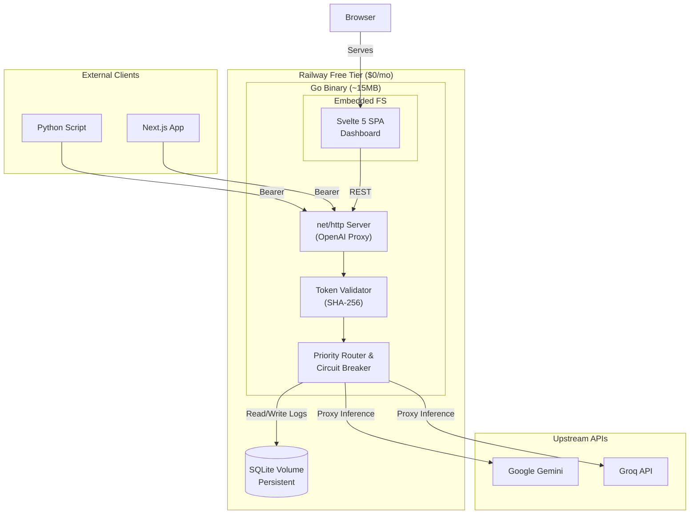

# System Design & Architecture

## Component Breakdown
1. **Proxy Layer:** Parses OpenAI-compatible JSON payloads, extracts model requirements.
2. **Auth Layer:** Validates the incoming Bearer token against the SQLite `tokens` table.
3. **Key Pool Manager:** An in-memory mutex-locked struct holding all keys. Evaluates healthy keys, sliding window RPM, and lowest latency.
4. **Circuit Breaker:** Catches 429s/5xx from upstream, marks key as `RateLimited`, sets a 60s cooldown, and retries the request with the next key.
5. **Logger (Background):** Batches request metrics to a Go channel, flushing to SQLite in WAL mode every 5 seconds to prevent write contention.
