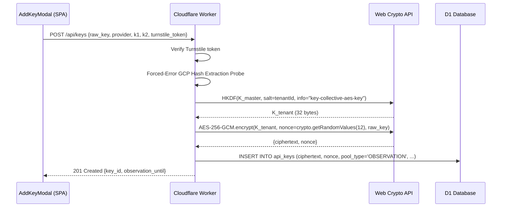
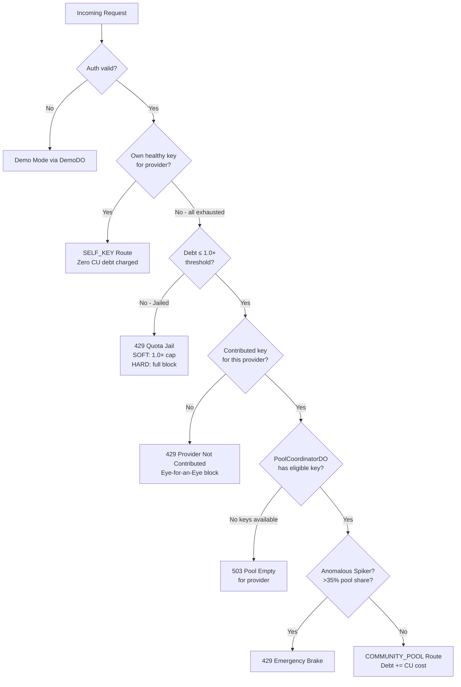

# System Design Document: Key Collective v4.0

**Version:** 4.0  
**Date:** 2026-09-14  
**Status:** Approved — PoolCoordinatorDO Singleton Architecture  
**Archetype:** fintech-compliance  

---

## 1. Component Topology

```mermaid
flowchart TD
    Client((Client / Developer)) -->|"OpenAI-compat API"| Edge[Cloudflare Worker Proxy<br/>api.key-col.axe08.tech]
    ConsoleClient((Browser SPA)) -->|"console.key-col.axe08.tech"| Console[Console Worker<br/>Svelte 5 SPA / Static Assets]
    
    Edge --> Auth[Auth Middleware<br/>JWT verify + tier lookup]
    Auth --> D1[(D1 Database<br/>key-collective-d1)]
    Auth --> Router[Self-Key Priority Router<br/>src/router/cascade.ts]
    
    Router -->|"Own keys available?"| TenantKeyPoolDO[KeyPoolDO<br/>Per-tenant isolation<br/>env.KEY_POOL.idFromName(tenantId)]
    Router -->|"Own keys exhausted?"| DebtCheck[Community Debt Check<br/>debt ≤ 1.0× threshold?]
    DebtCheck -->|"Eligible"| PoolCoordinatorDO[PoolCoordinatorDO<br/>Global Singleton<br/>env.POOL_COORDINATOR]
    DebtCheck -->|"Jailed"| QuotaJailReject[429 Quota Jail Response]
    
    TenantKeyPoolDO -->|"HKDF decrypt key"| UpstreamProvider[Upstream LLM Provider<br/>Gemini / Groq / SambaNova / Cerebras]
    PoolCoordinatorDO -->|"Select optimal community key"| UpstreamProvider
    
    Edge -->|"ctx.waitUntil"| Analytics[Workers Analytics Engine<br/>5 event types — non-blocking]
    Edge -->|"/report endpoint"| TakedownPortal[Takedown Portal<br/>200ms timing shield]
    
    subgraph DemoDO["Demo Sandbox"]
        DemoDO_obj[DemoDO<br/>Ephemeral 25 RPD shared pool]
    end
    
    Router -->|"Unauthenticated"| DemoDO_obj
```

---

## 2. Architectural Routes & Trade-off Table

| Route | Approach | Latency | Consistency | Complexity | Cost | Score |
|---|---|---|---|---|---|---|
| **A** | D1-only coordination | ❌ Slow (>50ms hot path) | ✅ ACID | ✅ Simple | ❌ High D1 IOPS | 55/100 |
| **B** | PoolCoordinatorDO Singleton | ✅ <5ms in-memory | ✅ Atomic per DO | ✅ Standard DO pattern | ✅ DO compute cheap | **83/100** |
| **C** | Per-Region DO Shards + CRDT sync | ✅✅ Global low lat | ❌ Eventual | ❌ Very complex | ❌ Cross-shard cost | 66/100 |

---

## 3. Recommended Route: B — PoolCoordinatorDO Singleton

**Rationale:**
- DO in-memory state enables <5ms routing overhead (SLA target)
- Atomic serialized requests eliminate race conditions on debt ledger mutations
- Cloudflare DO's single-location model is sufficient for v4.0 user base
- Flush to D1 asynchronously preserves hot-path speed
- Anomalous Spiker Brake (5-minute sliding window) is trivially implementable in-memory

See `docs/adr/004-commons-routing-architecture.md` for full ADR.

---

## 4. DO Topology & Responsibilities

### KeyPoolDO (`env.KEY_POOL.idFromName(tenantId)`)
- Stores per-tenant in-memory state: RPM counter, circuit breaker, active key list
- Handles HKDF derivation at key registration; stores only ciphertext in D1
- Dispatches requests to upstream provider; records latency + token counts
- Syncs circuit breaker state to `ctx.storage` (survives eviction)
- **Does NOT** have visibility into other tenants' keys

### PoolCoordinatorDO (`env.POOL_COORDINATOR.idFromName("global")`)
- **New in v4.0** — single global singleton
- Maintains in-memory registry of all `COMMUNITY_ACTIVE` keys (by provider)
- Tracks per-tenant traffic share for Anomalous Spiker Brake (35% cap)
- Selects optimal key using $W_{\text{provider}}$ quality weights
- Applies Eye-for-an-Eye provider matching rules
- Flushes pool metrics to D1 every 30 seconds via alarm
- Does NOT hold raw key material — delegates decryption to KeyPoolDO

### DemoDO (`env.DEMO_POOL.idFromName("global")`)
- Serves unauthenticated Demo Mode (25 RPD per IP)
- Ephemeral — resets on eviction (no persistent storage)

---

## 5. D1 Migration Plan

### Migration 0002: Commons Pooling (`0002_commons_pooling.sql`)
```sql
ALTER TABLE api_keys ADD COLUMN pool_type TEXT NOT NULL DEFAULT 'PRIVATE'
  CHECK(pool_type IN ('PRIVATE', 'COMMUNITY'));
ALTER TABLE api_keys ADD COLUMN community_routing_status TEXT NOT NULL DEFAULT 'OBSERVATION'
  CHECK(community_routing_status IN ('OBSERVATION', 'ACTIVE', 'QUARANTINED', 'REVOKED'));
ALTER TABLE api_keys ADD COLUMN observation_until INTEGER; -- unix timestamp
ALTER TABLE api_keys ADD COLUMN vesting_tier INTEGER NOT NULL DEFAULT 1
  CHECK(vesting_tier IN (1, 2, 3)); -- 1=Bronze, 2=Silver, 3=Gold
ALTER TABLE api_keys ADD COLUMN rotating_until INTEGER; -- unix timestamp for 30-min grace
```

### Migration 0003: Project Hash Registry (`0003_project_hash_registry.sql`)
```sql
CREATE TABLE project_hash_registry (
  gcp_project_hash TEXT PRIMARY KEY,
  state TEXT NOT NULL DEFAULT 'ACTIVE'
    CHECK(state IN ('ACTIVE', 'ROTATING', 'TOMBSTONED')),
  tombstoned_at INTEGER,
  tenant_id TEXT NOT NULL,
  created_at INTEGER NOT NULL DEFAULT (unixepoch())
);
-- 14-day tombstone index
CREATE INDEX idx_phash_tombstone ON project_hash_registry(state, tombstoned_at);
```

### Migration 0004: Contributor Standing (`0004_contributor_standing.sql`)
```sql
CREATE TABLE contributor_standing (
  tenant_id TEXT PRIMARY KEY,
  community_debt_micro_cu INTEGER NOT NULL DEFAULT 0,
  daily_contributed_micro_cu INTEGER NOT NULL DEFAULT 0,
  last_decay_date TEXT NOT NULL DEFAULT (date('now')),
  jail_status TEXT NOT NULL DEFAULT 'PRISTINE'
    CHECK(jail_status IN ('PRISTINE', 'SOFT_WARNING', 'HARD_JAIL')),
  trusted_contributor_streak_days INTEGER NOT NULL DEFAULT 0,
  updated_at INTEGER NOT NULL DEFAULT (unixepoch())
);

CREATE TABLE consent_attestations (
  id TEXT PRIMARY KEY DEFAULT (lower(hex(randomblob(16)))),
  tenant_id TEXT NOT NULL,
  consent_type TEXT NOT NULL CHECK(consent_type IN ('C1','C2','C3','K1','K2')),
  consent_version TEXT NOT NULL,
  attested_at INTEGER NOT NULL DEFAULT (unixepoch()),
  FOREIGN KEY(tenant_id) REFERENCES tenants(id)
);
CREATE INDEX idx_consent_tenant ON consent_attestations(tenant_id, consent_type);
```

---

## 6. HKDF Per-Tenant Key Derivation Flow



**Security invariant:** `K_master` stored only in Worker Secrets. `K_tenant` never persisted — derived fresh on each decryption. Zero cross-tenant key material sharing.

---

## 7. Request Routing Decision Tree



---

## 8. SLA Budget

| Operation | P50 | P95 Target | Notes |
|---|---|---|---|
| Auth Middleware (JWT + D1 tier lookup) | ~2ms | <8ms | D1 cached in DO warm state |
| Self-Key Priority Router (own key lookup) | ~1ms | <5ms | In-memory KeyPoolDO |
| Community Pool Routing (PoolCoordinatorDO) | ~2ms | <5ms | In-memory singleton |
| Upstream LLM Provider (first token) | ~500ms | ~3000ms | Not in our SLA |
| **Total Proxy Overhead P95** | ~5ms | **<100ms** | Exceeds SLA requirement |
| HKDF Derivation (key decryption) | ~2ms | <10ms | WebCrypto — hardware accel |
| Takedown Portal response | 200ms | 200-220ms | Constant-time shield |
| Analytics Engine write | 0ms (async) | 0ms (async) | `ctx.waitUntil()` |
