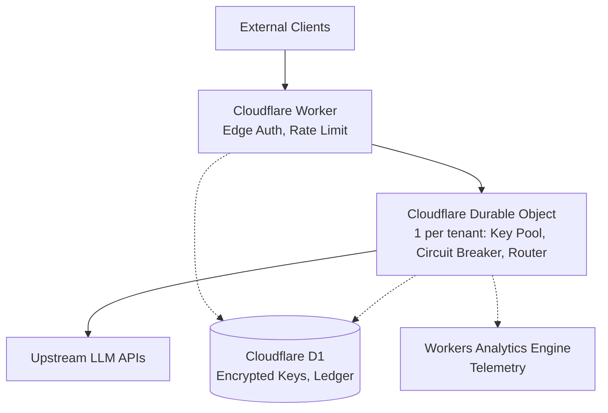

# System Design

## Architecture

## Component Breakdown

- **Cloudflare Worker**: Handles edge authentication (Bearer + timingSafeEqual), model alias resolution from D1, rate limiting, and routes requests to the appropriate tenant DO.
- **Cloudflare Durable Object**: One per tenant instantiated via `idFromName(tenantId)`. Manages in-memory key pool, AES-256-GCM decrypt (Web Crypto API), key selection, circuit breaker (flushed to DO transactional storage), RPM window, SSE stream relay, and async cost accumulator.
- **Cloudflare D1**: SQL database used as the encrypted key store (ciphertext+nonce), model registry (pricing in int64 microdollars), cost ledger rollups, and auth tokens.
- **Workers Analytics Engine**: Ingests and stores per-request telemetry for analytics.
