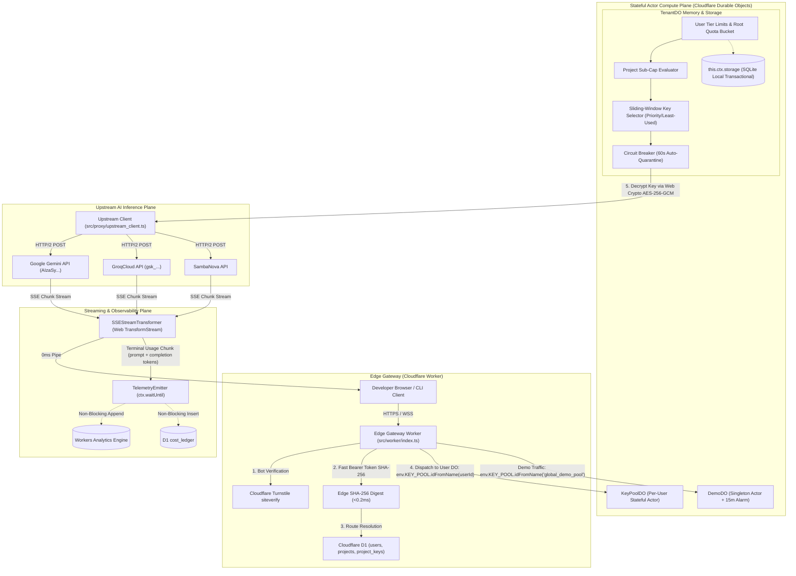

# System Design: Key Collective v3 — Multi-Project, Anti-Sybil & Tiered Developer Platform

## 1. 🏗️ High-Level Architecture

Key Collective v3 is architected as a **Dual-Plane Edge Actor Engine** running entirely within Cloudflare Workers, SQLite Durable Objects, D1 relational persistence, and Workers Analytics Engine:



---

## 2. 🔄 Database Schemas (Cloudflare D1 Migration `0002_v3_multi_project.sql`)

```sql
-- 1. Users Table (GitHub OAuth Identity & Tier)
CREATE TABLE IF NOT EXISTS users (
    id TEXT PRIMARY KEY,                       -- e.g. "usr_gh_12948174"
    github_id INTEGER NOT NULL UNIQUE,
    github_username TEXT NOT NULL,
    primary_email TEXT NOT NULL,
    avatar_url TEXT,
    tier TEXT NOT NULL DEFAULT 'builder',      -- 'admin', 'ultra', 'max', 'builder', 'probationary', 'suspended'
    sybil_score INTEGER NOT NULL DEFAULT 100,
    is_email_verified INTEGER NOT NULL DEFAULT 1,
    github_created_at TIMESTAMP,
    registration_ip TEXT NOT NULL,
    created_at TIMESTAMP NOT NULL DEFAULT CURRENT_TIMESTAMP,
    updated_at TIMESTAMP NOT NULL DEFAULT CURRENT_TIMESTAMP
);

CREATE INDEX IF NOT EXISTS idx_users_github ON users(github_id);
CREATE INDEX IF NOT EXISTS idx_users_tier ON users(tier);

-- 2. Projects Table (GCP / AI Studio Style Hierarchy)
CREATE TABLE IF NOT EXISTS projects (
    id TEXT PRIMARY KEY,                       -- e.g. "proj_rag_app_89f"
    tenant_id TEXT NOT NULL,                   -- Foreign key to users.id
    name TEXT NOT NULL,
    slug TEXT NOT NULL,
    description TEXT,
    max_rpm_sub_cap INTEGER,                   -- Optional sub-limit (NULL = inherit user ceiling)
    is_archived INTEGER NOT NULL DEFAULT 0,
    created_at TIMESTAMP NOT NULL DEFAULT CURRENT_TIMESTAMP,
    updated_at TIMESTAMP NOT NULL DEFAULT CURRENT_TIMESTAMP,
    FOREIGN KEY(tenant_id) REFERENCES users(id) ON DELETE CASCADE
);

CREATE INDEX IF NOT EXISTS idx_projects_tenant ON projects(tenant_id, is_archived);
CREATE UNIQUE INDEX IF NOT EXISTS idx_projects_slug ON projects(tenant_id, slug);

-- 3. Project-Scoped API Keys Table
CREATE TABLE IF NOT EXISTS project_keys (
    id TEXT PRIMARY KEY,                       -- e.g. "key_cln_19a8f"
    project_id TEXT NOT NULL,                  -- Foreign key to projects.id
    tenant_id TEXT NOT NULL,                   -- Foreign key to users.id
    name TEXT NOT NULL,
    token_prefix TEXT NOT NULL,                -- "kc_proj_8Yk2" (first 12 chars for display)
    token_hash_sha256 TEXT NOT NULL UNIQUE,    -- Constant-time edge verification
    is_revoked INTEGER NOT NULL DEFAULT 0,
    last_used_at TIMESTAMP,
    created_at TIMESTAMP NOT NULL DEFAULT CURRENT_TIMESTAMP,
    FOREIGN KEY(project_id) REFERENCES projects(id) ON DELETE CASCADE,
    FOREIGN KEY(tenant_id) REFERENCES users(id) ON DELETE CASCADE
);

CREATE INDEX IF NOT EXISTS idx_project_keys_hash ON project_keys(token_hash_sha256);
CREATE INDEX IF NOT EXISTS idx_project_keys_project ON project_keys(project_id, is_revoked);
```

---

## 3. ⏱️ Ephemeral Demo Tier State Machine & DO Alarm Engine

```typescript
export class DemoDO implements DurableObject {
  private currentToken: string = "";
  private tokenExpiresAt: number = 0;
  private readonly ROTATION_INTERVAL_MS = 15 * 60 * 1000; // 15 Minutes
  private ipSlidingWindows: Map<string, { requests: number; windowStart: number }> = new Map();

  constructor(private readonly ctx: DurableObjectStateLike) {
    this.ctx.blockConcurrencyWhile(async () => {
      await this.ensureInitialized();
    });
  }

  private async ensureInitialized(): Promise<void> {
    const savedToken = await this.ctx.storage.get<string>("demo:token");
    const savedExpiry = await this.ctx.storage.get<number>("demo:expiry");
    const now = Date.now();

    if (savedToken && savedExpiry && savedExpiry > now) {
      this.currentToken = savedToken;
      this.tokenExpiresAt = savedExpiry;
    } else {
      await this.rotateToken();
    }
  }

  public async alarm(): Promise<void> {
    // Scheduled 15-minute rotation fired by Cloudflare runtime
    await this.rotateToken();
  }

  private async rotateToken(): Promise<void> {
    const randomBytes = crypto.getRandomValues(new Uint8Array(16));
    const tokenSuffix = Array.from(randomBytes).map(b => b.toString(16).padStart(2, '0')).join('').slice(0, 12);
    const now = Date.now();

    this.tokenExpiresAt = now + this.ROTATION_INTERVAL_MS;
    this.currentToken = `kc_demo_${Math.floor(now / 1000)}_${tokenSuffix}`;

    await this.ctx.storage.put("demo:token", this.currentToken);
    await this.ctx.storage.put("demo:expiry", this.tokenExpiresAt);

    // Prune stale IP rate-limiting windows
    const oneHourAgo = now - 3600000;
    for (const [ip, data] of this.ipSlidingWindows.entries()) {
      if (data.windowStart < oneHourAgo) {
        this.ipSlidingWindows.delete(ip);
      }
    }

    // Reschedule next rotation
    await this.ctx.storage.setAlarm(this.tokenExpiresAt);
  }

  public async getActiveDemoToken(): Promise<{ token: string; expiresAt: number }> {
    return { token: this.currentToken, expiresAt: this.tokenExpiresAt };
  }
}
```

---

## 4. 🛡️ Reliability & Invariants
- **No Plaintext Keys:** Upstream keys are decrypted strictly in V8 heap memory during fetch dispatch and immediately discarded.
- **Microdollar Accounting:** Token calculations use `int64` microdollars ($1 USD = 1,000,000 µ$). Zero float math.
- **Failover SLA:** If an upstream provider responds with HTTP 429, failover to the next healthy sibling key completes in $<50\text{ms}$.
- **Non-Blocking Telemetry:** Hot proxy paths stream SSE chunks directly to clients while deferring database rollups to `ctx.waitUntil()`.

## 🔗 Related References
- PRD: [[PRD_v3]]
- Data Contracts: [[docs/architecture/v3_data_contracts.ts]]
- Golden Tests: [[docs/golden_tests/v3_cases.yaml]]
- Threat Model: [[docs/architecture/v3_threat_model.md]]
- CI/CD Architecture: [[docs/ci_cd_architecture.md]]
