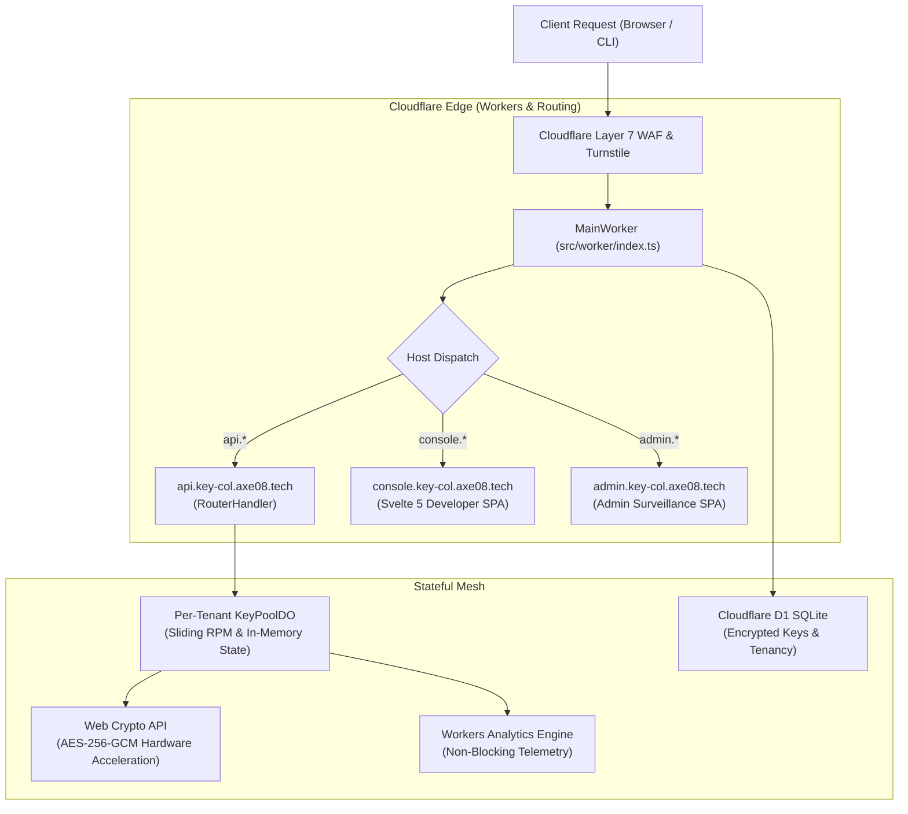

# System Design Specification — Key Collective v3.5
## Subdomain Host Routing, Two-Phase Identity, Hidden Tiers & Admin Surveillance Architecture

> **Document Status:** Verified  
> **System:** Key Collective v3.5  
> **Target Platform:** Cloudflare Workers, Durable Objects, D1 SQLite, Web Crypto API  

---

## 1. High-Level Architecture Topology



---

## 2. Subdomain Routing Implementation (`src/worker/index.ts`)

```typescript
export interface Env {
  DB: D1Database;
  KEY_POOL: DurableObjectNamespace;
  DEMO_POOL: DurableObjectNamespace;
  ASSETS: Fetcher;
  MASTER_KEY_PASSPHRASE: string;
  ADMIN_EMAILS?: string;
  GITHUB_CLIENT_ID?: string;
  GITHUB_CLIENT_SECRET?: string;
}

export function parseSubdomain(host: string): 'api' | 'console' | 'admin' | 'apex' {
  if (host.startsWith('api.')) return 'api';
  if (host.startsWith('admin.')) return 'admin';
  if (host.startsWith('console.')) return 'console';
  return 'apex';
}
```

---

## 3. Two-Phase Identity Ingress Flow

```mermaid
sequenceDiagram
    autonumber
    actor Dev as Developer
    participant Edge as Cloudflare Edge Worker
    participant D1 as D1 SQLite Database
    participant GH as GitHub REST API
    participant DO as KeyPoolDO

    Note over Dev,Edge: Phase 1: Ingress Sandbox (Probationary)
    Dev->>Edge: POST /api/auth/ingress (Email + Turnstile Nonce)
    Edge->>D1: INSERT INTO users (tier='probationary', max_rpm=2, max_rpd=50)
    Edge-->>Dev: Issue Probationary Bearer Token (kc_prob_...)

    Note over Dev,Edge: Phase 2: Identity Elevation Gate (Builder)
    Dev->>Edge: GET /api/auth/github/authorize (Initiate PKCE)
    Edge-->>Dev: 302 Redirect to GitHub with state & code_challenge
    Dev->>Edge: GET /api/auth/github/callback?code=...&state=...
    Edge->>GH: POST https://github.com/login/oauth/access_token
    GH-->>Edge: Returns access_token
    Edge->>GH: GET https://api.github.com/user + /user/emails
    GH-->>Edge: User Profile (created_at, public_repos, commits)
    
    Note over Edge: Execute 5-Point Sybil Verification
    Edge->>D1: Check UNIQUE(github_user_id)
    alt Sybil Pass (Age >= 60d, Commits >= 15, Clean Email)
        Edge->>D1: UPDATE users SET tier='builder', is_github_verified=1
        Edge->>DO: Refresh Tenant Quota Ceiling in RAM
        Edge-->>Dev: 302 Redirect to console with Tier: Builder
    else Sybil Fail / Underage
        Edge-->>Dev: 302 Redirect with warning: "Account age insufficient; sandbox active"
    end
```

---

## 4. D1 Database Schema Extension (`migrations/0003_v3_5_governance.sql`)

```sql
-- Migration 0003: v3.5 Identity, Hidden Tiers & Admin Surveillance

-- 1. Extend users table
ALTER TABLE users ADD COLUMN auth_provider TEXT NOT NULL DEFAULT 'email';
ALTER TABLE users ADD COLUMN github_user_id INTEGER UNIQUE;
ALTER TABLE users ADD COLUMN is_github_verified INTEGER NOT NULL DEFAULT 0;
ALTER TABLE users ADD COLUMN sybil_score INTEGER NOT NULL DEFAULT 0;
ALTER TABLE users ADD COLUMN is_quarantined INTEGER NOT NULL DEFAULT 0;
ALTER TABLE users ADD COLUMN quarantine_reason TEXT;

-- 2. Indexes for O(1) Lookups
CREATE INDEX IF NOT EXISTS idx_users_github_user_id ON users(github_user_id);
CREATE INDEX IF NOT EXISTS idx_users_tier ON users(tier);
CREATE INDEX IF NOT EXISTS idx_users_email ON users(email);

-- 3. Admin Audit Trail
CREATE TABLE IF NOT EXISTS admin_audit_logs (
    id TEXT PRIMARY KEY,
    admin_email TEXT NOT NULL,
    action TEXT NOT NULL, -- 'TIER_OVERRIDE', 'QUARANTINE_TENANT', 'CIRCUIT_TRIP'
    target_tenant_id TEXT,
    details_json TEXT NOT NULL,
    ip_address TEXT NOT NULL,
    created_at INTEGER DEFAULT (strftime('%s', 'now'))
);

CREATE INDEX IF NOT EXISTS idx_audit_created ON admin_audit_logs(created_at);
```

---

## 5. Admin Panel Security (Edge-Guarded 404 Denial)

When an unauthenticated visitor or non-admin attempts to access `admin.key-col.axe08.tech` or request `/admin` assets:
1. The Worker intercepts the request before passing to `env.ASSETS`.
2. Verifies the Bearer token against D1: `SELECT tier, is_quarantined FROM users WHERE id = ?`.
3. Checks whether the verified user email is listed in `env.ADMIN_EMAILS` or has `tier === 'admin'`.
4. **If verification fails, returns an absolute `HTTP 404 Not Found` with body `Not Found`.**
5. Zero confirmation is given that an admin application exists at this host.
