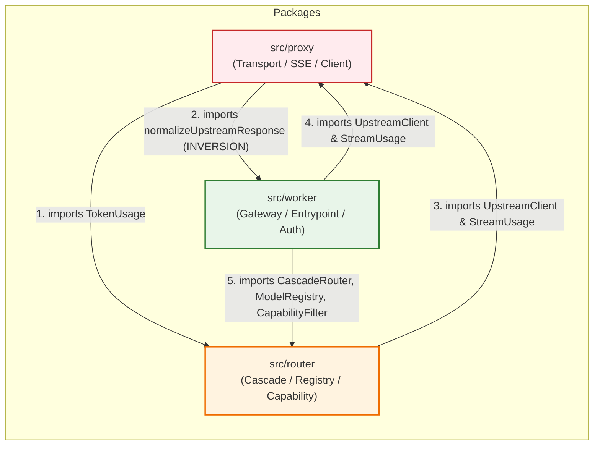
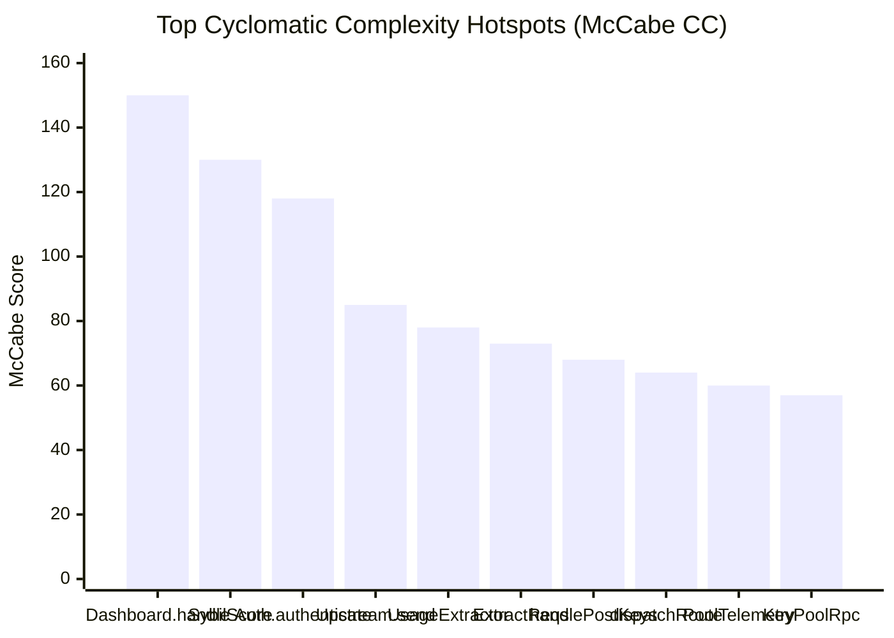
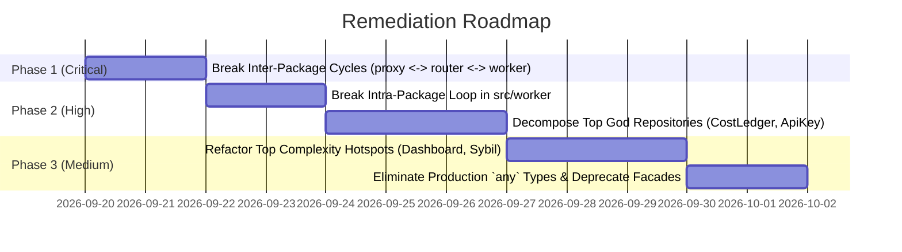

# ⚠️ Key Collective: Architecture Smells & Technical Debt Audit Report

> **Auditor:** Architecture Debt Sentinel (Gemini 3.7 Flash)  
> **Date:** September 19, 2026  
> **Target Codebase:** `Key Collective` (Cloudflare Workers & Durable Objects)  
> **Scope:** Post-refactor modular architecture (`src/worker`, `src/router`, `src/durable_objects`, `src/quota`, `src/proxy`, `src/crypto`, `src/storage`, `src/auth`, `src/pool`)  
> **Test Suite Health:** ✅ 36 test files passed, 842 tests passing (`npm run gate` < 8s)  

---

## Executive Summary

Over the past week, the Key Collective codebase underwent a major modular refactor aimed at decomposing legacy monoliths into domain packages. While the test suite passes with 100% green status (842/842 tests) and zero `@ts-ignore` suppressions, an exhaustive AST graph and architectural invariant audit reveals significant **residual coupling, layer inversions, circular dependencies, and extreme cyclomatic complexity hotspots**.

Key findings include:
1. **Critical Inter-Package Circular Dependency (`proxy <-> router <-> worker`):** The lower transport layer (`proxy`) inappropriately imports from the outer gateway (`worker`) and the router (`router`), while `router` and `worker` depend on `proxy`.
2. **High-Severity Intra-Package Circular Loop (9 files in `src/worker`):** Gateway handlers and dashboard routers form a closed dependency loop spanning 9 files.
3. **20 Production God Classes:** Core repositories and Durable Objects (`CostLedgerRepository` at 840 LOC / 20 methods, `ModelRegistry` at 660 LOC / 34 methods, `ApiKeyRepository` at 623 LOC / 28 methods, `KeyPoolDO` at 607 LOC / 36 methods) continue to concentrate too many disparate responsibilities.
4. **117 Cyclomatic Complexity Hotspots (McCabe > 10):** The top three functions alone exhibit extreme McCabe complexity scores: `DashboardRouter.handle` (CC: 150), `calculateSybilScore` (CC: 130), and `AuthMiddleware.authenticate` (CC: 118).
5. **Constitution Invariant Deviations:** 27 occurrences of `any` in production code (violating the "TypeScript strict mode, no `any`" constitution rule), primarily around DurableObjectStorage alarm polyfills and mock stubs.

---

## 1. Summary Severity Dashboard

| Smell / Debt Category | Total Detected | Severity | Status | Primary Remediation Action |
|---|---|---|---|---|
| **Inter-Package Cycles** | **1 cycle (3 pkgs)** | **CRITICAL** | 🚨 Layer Inversion | Extract contracts (`TokenUsage`) & move `error_normalizer` to transport |
| **Intra-Package Cycles** | **1 cycle (9 files)** | **HIGH** | ⚠️ Circular Loop | Decouple `admin_handler` from `dashboard_handler`; isolate shared types |
| **God Classes (>10 methods / >200 LOC)** | **20 classes** | **HIGH** | ⚠️ Concentrated State | Decompose query builders & RPC handlers into SRP services |
| **Monolithic Files (>=300 LOC)** | **30 files** | **MEDIUM** | ⚠️ Maintenance Risk | Split routing tables, validators, and repository queries |
| **Complexity Hotspots (McCabe > 10)** | **117 functions** | **HIGH** | ⚠️ Error Prone | Refactor monolithic `switch`/`if-else` cascades into lookup tables |
| **Constitution `any` Usages** | **27 prod (49 total)** | **MEDIUM** | ⚠️ Type Escape | Define strict `DurableObjectStorageWithAlarm` interfaces |
| **Smart Facade Coupling** | **9 references** | **LOW** | ℹ️ Lingering Shims | Migrate remaining call sites to deep canonical domain imports |

---

## 2. Circular Dependency Analysis

### 2.1 Critical Inter-Package Cycle: `proxy <-> router <-> worker`

An architectural layer inversion exists where `proxy` (which should strictly serve as an outbound HTTP transport and stream transformer) depends on higher-level packages (`router` and `worker`):



#### Detailed Inverted Edges:
1. **`proxy -> router` (1 edge):**
   - File: [`src/proxy/sse/types.ts:6`](file:///home/akshit/Projects/Key%20Collective/src/proxy/sse/types.ts#L6)
   - Code: `import type { TokenUsage } from "../../router/registry/index";`
   - *Architectural defect:* `TokenUsage` is a fundamental domain contract representing LLM consumption tokens. Its definition in `router/registry` forces `proxy` to import from `router`.
   - *Remediation:* Elevate `TokenUsage` into [`src/contracts/telemetry.ts`](file:///home/akshit/Projects/Key%20Collective/src/contracts/telemetry.ts) or [`src/contracts/keys.ts`](file:///home/akshit/Projects/Key%20Collective/src/contracts/keys.ts).

2. **`proxy -> worker` (1 edge - Layer Inversion):**
   - File: [`src/proxy/upstream/client.ts:16`](file:///home/akshit/Projects/Key%20Collective/src/proxy/upstream/client.ts#L16)
   - Code: `import { normalizeUpstreamResponse } from "../../worker/error_normalizer";`
   - *Architectural defect:* `error_normalizer.ts` has zero external dependencies and sanitizes upstream HTTP error responses and headers (e.g., stripping GCP project IDs, secret tokens, billing accounts). Placing it in `src/worker/` inverts the architecture: low-level HTTP clients should never import from the application worker shell.
   - *Remediation:* Move `error_normalizer.ts` into `src/proxy/upstream/normalizer.ts` or `src/utils/sanitizer.ts`.

3. **`router -> proxy` (3 edges):**
   - [`src/router/cascade/router.ts:8`](file:///home/akshit/Projects/Key%20Collective/src/router/cascade/router.ts#L8) imports `UpstreamClient` from `src/proxy/upstream/index`.
   - [`src/router/cascade/types.ts:7`](file:///home/akshit/Projects/Key%20Collective/src/router/cascade/types.ts#L7) imports `UpstreamClient` and `UpstreamResponse`.
   - [`src/router/cascade/types.ts:8`](file:///home/akshit/Projects/Key%20Collective/src/router/cascade/types.ts#L8) imports `StreamUsage` from `src/proxy/sse/index`.

4. **`pool -> worker` Coupling:**
   - File: [`src/pool/coordinator_do.ts:1`](file:///home/akshit/Projects/Key%20Collective/src/pool/coordinator_do.ts#L1)
   - Code: `import type { WorkerEnv } from "../worker/auth/index";`
   - *Architectural defect:* The global pool coordinator Durable Object imports worker authentication environment types rather than depending on a common configuration contract.
   - *Remediation:* Move `WorkerEnv` to [`src/types/config.ts`](file:///home/akshit/Projects/Key%20Collective/src/types/config.ts) or [`src/contracts/index.ts`](file:///home/akshit/Projects/Key%20Collective/src/contracts/index.ts).

---

### 2.2 Intra-Package Circular Dependency (9 Files in `src/worker`)

Tarjan's strongly connected components algorithm detected a 9-node circular loop between the worker gateway and router modules:

```mermaid
flowchart TD
    subgraph WorkerGatewayAndRouterCycle["Worker Gateway <-> Router Circular Loop"]
        G_SUB["src/worker/gateway/subdomain.ts"] --> G_TYP["src/worker/gateway/types.ts"]
        G_TYP --> R_IDX["src/worker/router/index.ts"]
        R_IDX --> R_HND["src/worker/router/router_handler.ts"]
        R_HND --> R_DIS["src/worker/router/core/dispatcher.ts"]
        R_DIS --> R_DSH["src/worker/router/dashboard_handler.ts"]
        R_DSH --> D_IDX["src/worker/router/dashboard/index.ts"]
        D_IDX --> D_HND["src/worker/router/dashboard/handler.ts"]
        D_HND --> G_ADM["src/worker/gateway/admin_handler.ts"]
        G_ADM --> G_SUB
    end

    style G_SUB fill:#fbe9e7,stroke:#d84315
    style G_TYP fill:#fbe9e7,stroke:#d84315
    style G_ADM fill:#fbe9e7,stroke:#d84315
    style R_HND fill:#e1f5fe,stroke:#0277bd
    style D_HND fill:#e1f5fe,stroke:#0277bd
```



#### Loop Causality Trace:
1. `src/worker/gateway/admin_handler.ts` handles admin routes and imports `applyCors` from `src/worker/gateway/subdomain.ts`.
2. `src/worker/gateway/subdomain.ts` imports `WorkerOptions` from `src/worker/gateway/types.ts`.
3. `src/worker/gateway/types.ts` imports `RouterHandler` from `src/worker/router/index.ts`.
4. `src/worker/router/index.ts` re-exports `RouterHandler` from `src/worker/router/router_handler.ts`.
5. `src/worker/router/router_handler.ts` imports `dispatchRoute` from `src/worker/router/core/dispatcher.ts`.
6. `src/worker/router/core/dispatcher.ts` imports `handleDashboardRequest` from `src/worker/router/dashboard_handler.ts`.
7. `src/worker/router/dashboard_handler.ts` forwards to `src/worker/router/dashboard/index.ts`.
8. `src/worker/router/dashboard/index.ts` re-exports `DashboardRouter` from `src/worker/router/dashboard/handler.ts`.
9. `src/worker/router/dashboard/handler.ts` directly imports and calls `handleAdminRequest` from `src/worker/gateway/admin_handler.ts` (line 33).

*Root Cause:* Admin request handling is split between `gateway/admin_handler.ts` (which implements `/api/admin/*` endpoints) and `dashboard/handler.ts` (which delegates to it), while `gateway` types simultaneously reference `router` handlers.  
*Remediation:* Consolidate admin routes exclusively into `admin_handler.ts` or `dashboard/admin_routes.ts`, and eliminate the dependency of `gateway/types.ts` on `RouterHandler` by using a decoupled generic handler interface `(req: Request, env: Env) => Promise<Response>`.

---

### 2.3 Residual Smart Re-Export Facade Usage

During the modular refactor, legacy top-level files were converted into facades (`export * from ...`). Several active domain packages still import from the old facade shims instead of canonical subpaths:

| Facade Path | Residual Call Sites | Referencing Files | Recommended Direct Import |
|---|---|---|---|
| `durable_objects/circuit_breaker` | 3 | `quota/tenant/types.ts`, `worker/auth/storage.ts` | `contracts/storage.ts` (extract `DurableObjectStorageLike`) |
| `durable_objects/key_selector` | 3 | `worker/router/types.ts`, `worker/router/do_client.ts`, `worker/router/dashboard/metrics_routes.ts` | `durable_objects/key_selector/types.ts` |
| `durable_objects/rate_limiter` | 2 | `worker/auth/middleware.ts`, `worker/auth/types.ts` | `durable_objects/rate_limiter/index.ts` |
| `durable_objects/key_pool_do` | 1 | `src/index.ts` | `durable_objects/key_pool/key_pool_do.ts` |

---

## 3. God Classes & Monolithic Subsystems

Classes exceeding **200 LOC** or **10 methods** violate the Single Responsibility Principle (SRP) by fusing query generation, business validation, caching, and state synchronization.

### 3.1 Top 10 Production God Classes

| # | Class | Location | LOC | Methods | Core Responsibilities & Debt Profile |
|---|---|---|---|---|---|
| 1 | `CostLedgerRepository` | [`src/storage/repositories/cost_ledger/repository.ts`](file:///home/akshit/Projects/Key%20Collective/src/storage/repositories/cost_ledger/repository.ts) | **840** | 20 | Monolithic D1 SQL builder, financial accounting, multi-tenant balance reconciliation, rollup generation, and raw transaction logging. |
| 2 | `ModelRegistry` | [`src/router/registry/registry.ts`](file:///home/akshit/Projects/Key%20Collective/src/router/registry/registry.ts) | **660** | 34 | In-memory model catalog, pricing calculation, provider alias aliasing, capability filtering, fallback chain resolution, and validation. |
| 3 | `ApiKeyRepository` | [`src/storage/repositories/api_keys/repository.ts`](file:///home/akshit/Projects/Key%20Collective/src/storage/repositories/api_keys/repository.ts) | **623** | 28 | Key CRUD, cryptographic hash lookup, status lifecycle transitions, tenant key quotas, rate limit parameters, and secret rotation. |
| 4 | `KeyPoolDO` | [`src/durable_objects/key_pool/key_pool_do.ts`](file:///home/akshit/Projects/Key%20Collective/src/durable_objects/key_pool/key_pool_do.ts) | **607** | 36 | Key leasing, tier arbitration, circuit breaker synchronization, sliding-window rate tracking, quarantine queues, and RPC handling. |
| 5 | `UpstreamClient` | [`src/proxy/upstream/client.ts`](file:///home/akshit/Projects/Key%20Collective/src/proxy/upstream/client.ts) | **600** | 14 | Upstream HTTP dispatching, EWMA latency tracking, exponential backoff, auth header rewriting, and SSE stream interception. |
| 6 | `AuthMiddleware` | [`src/worker/auth/middleware.ts`](file:///home/akshit/Projects/Key%20Collective/src/worker/auth/middleware.ts) | **581** | 6 | Procedural mega-middleware: Bearer extraction, D1 token validation, Sybil score verification, OAuth session lookup, and DO rate-limiting. |
| 7 | `AuthTokensRepository` | [`src/storage/repositories/auth_tokens/repository.ts`](file:///home/akshit/Projects/Key%20Collective/src/storage/repositories/auth_tokens/repository.ts) | **496** | 15 | Token generation, SHA-256 hash matching, revocation lists, scope validation, and metadata auditing. |
| 8 | `ModelRegistryRepository` | [`src/storage/repositories/model_registry/repository.ts`](file:///home/akshit/Projects/Key%20Collective/src/storage/repositories/model_registry/repository.ts) | **487** | 18 | Dynamic model D1 persistence, pricing table CRUD, capability flag indexing, and provider mappings. |
| 9 | `RateLimiter` | [`src/durable_objects/rate_limiter/limiter.ts`](file:///home/akshit/Projects/Key%20Collective/src/durable_objects/rate_limiter/limiter.ts) | **452** | 23 | Sliding window rate limiting, token bucket calculation, tier quotas, and transactional DO storage sync. |
| 10 | `TenantQuotaDO` | [`src/quota/tenant/tenant_do.ts`](file:///home/akshit/Projects/Key%20Collective/src/quota/tenant/tenant_do.ts) | **404** | 21 | Multi-tenant debt calculation, daily quota alarms, community credit multipliers, and RPC handling. |

---

## 4. Cyclomatic Complexity Hotspots

McCabe cyclomatic complexity measures the number of linearly independent paths through program modules. A score above 10 indicates high maintenance difficulty; scores above 50 represent extreme error proneness.

### 4.1 Top 15 Extreme Complexity Hotspots (McCabe > 30)



| # | Function / Method | File & Line | McCabe CC | LOC | Description & Contributing Factors |
|---|---|---|---|---|---|
| 1 | `DashboardRouter.handle` | [`src/worker/router/dashboard/handler.ts:42`](file:///home/akshit/Projects/Key%20Collective/src/worker/router/dashboard/handler.ts#L42) | **150** | 360 | Massive procedural URL router matching 20+ endpoints with nested method checks, path regexes, query parameter extraction, and authorization gates. |
| 2 | `calculateSybilScore` | [`src/auth/sybil/scoring.ts:72`](file:///home/akshit/Projects/Key%20Collective/src/auth/sybil/scoring.ts#L72) | **130** | 353 | Multi-factor risk heuristics engine evaluating Turnstile tokens, IP reputation, ASN classification, browser entropy, and account age. |
| 3 | `AuthMiddleware.authenticate` | [`src/worker/auth/middleware.ts:177`](file:///home/akshit/Projects/Key%20Collective/src/worker/auth/middleware.ts#L177) | **118** | 440 | Giant monolithic authentication pipeline interleaving API key verification, OAuth cookies, Sybil checks, D1 lookups, and DO rate limiting. |
| 4 | `UpstreamClient.send` | [`src/proxy/upstream/client.ts:198`](file:///home/akshit/Projects/Key%20Collective/src/proxy/upstream/client.ts#L198) | **85** | 333 | HTTP client execution loop: header rewriting, fallback key injection, timeout estimation, retry loops, streaming vs non-streaming forks. |
| 5 | `extractUsageFromPayload` | [`src/proxy/sse/usage_extractor.ts:12`](file:///home/akshit/Projects/Key%20Collective/src/proxy/sse/usage_extractor.ts#L12) | **78** | 205 | Dialect parser extracting token counts across OpenAI, Anthropic, Gemini, Groq, Mistral, and DeepSeek SSE streaming payloads. |
| 6 | `extractRequirements` | [`src/router/capability/extractor.ts:19`](file:///home/akshit/Projects/Key%20Collective/src/router/capability/extractor.ts#L19) | **73** | 182 | Request parser inspecting chat completion JSON payloads for vision, function calling, structured outputs, context length, and reasoning. |
| 7 | `handlePostKeys` | [`src/worker/router/dashboard/keys/post_key.ts:16`](file:///home/akshit/Projects/Key%20Collective/src/worker/router/dashboard/keys/post_key.ts#L16) | **68** | 162 | Complex validation, provider connectivity probe, AES-256-GCM encryption, D1 insertion, and tenant quota updates. |
| 8 | `dispatchRoute` | [`src/worker/router/core/dispatcher.ts:74`](file:///home/akshit/Projects/Key%20Collective/src/worker/router/core/dispatcher.ts#L74) | **64** | 259 | Top-level request routing dispatcher matching subdomains, `/v1/chat/completions`, and management APIs. |
| 9 | `handlePoolTelemetry` | [`src/worker/pool_routes.ts:20`](file:///home/akshit/Projects/Key%20Collective/src/worker/pool_routes.ts#L20) | **60** | 163 | Cross-tenant metrics parsing, circuit breaker status aggregation, and analytics serialization. |
| 10 | `handleKeyPoolRpc` | [`src/durable_objects/key_pool/rpc.ts:35`](file:///home/akshit/Projects/Key%20Collective/src/durable_objects/key_pool/rpc.ts#L35) | **57** | 193 | DO RPC command multiplexer deserializing method names, validating parameters, and formatting binary/JSON responses. |
| 11 | `handleGetKeys` | [`src/worker/router/dashboard/keys/get_keys.ts:11`](file:///home/akshit/Projects/Key%20Collective/src/worker/router/dashboard/keys/get_keys.ts#L11) | **50** | 161 | Multi-parameter key filtering, pagination, secret masking, and status enrichment. |
| 12 | `handlePostTokens` | [`src/worker/router/dashboard/token_routes.ts:263`](file:///home/akshit/Projects/Key%20Collective/src/worker/router/dashboard/token_routes.ts#L263) | **45** | 149 | Token generation, tier allowance checks, cryptographic hashing, and D1 transactional persistence. |
| 13 | `MainWorker.fetch` | [`src/worker/gateway/main_worker.ts:95`](file:///home/akshit/Projects/Key%20Collective/src/worker/gateway/main_worker.ts#L95) | **39** | 117 | Edge entrypoint dispatcher routing based on subdomains (admin.*, console.*, api.*), CORS preflights, and healthchecks. |
| 14 | `executeCascadeRouting` | [`src/router/cascade/fallback.ts:56`](file:///home/akshit/Projects/Key%20Collective/src/router/cascade/fallback.ts#L56) | **39** | 159 | Multi-stage cascade fallback loop: attempts primary provider, monitors error codes, trips circuit breakers, and cascades to alternatives. |
| 15 | `handleReportKeyAbuse` | [`src/worker/router/dashboard/abuse_routes.ts:9`](file:///home/akshit/Projects/Key%20Collective/src/worker/router/dashboard/abuse_routes.ts#L9) | **38** | 118 | Abuse detection, quarantine state transition, and notification broadcast. |

---

## 5. Architectural Invariants & Constitution Compliance

### 5.1 Constitution Compliance Matrix

| Invariant / Constitution Rule | Status | Findings |
|---|---|---|
| **1. TypeScript strict mode, no `any`** | ⚠️ Deviations | **27 `any` casts in production code** (e.g. `(this.ctx.storage as any).getAlarm()`, `as any` in `probe.ts`, `stub as any` in `middleware.ts`). Zero `@ts-ignore` or `@ts-expect-error`. |
| **2. No Plaintext Keys (AES-256-GCM)** | ✅ Compliant | Cryptographic encryption via Web Crypto API uses 12-byte IVs stored alongside ciphertext in D1. Zero key material logged. |
| **3. Per-Tenant DO Isolation** | ✅ Compliant | All tenant key pools and rate limiters instantiate via `env.KEY_POOL.idFromName(tenantId)` and `env.TENANT_QUOTA.idFromName(tenantId)`. Global DOs (`POOL_COORDINATOR`, `DEMO_DO`) explicitly coordinate cross-tenant capacity without state leakage. |
| **4. Fixed-Point Microdollars (Zero Floats)** | ✅ Compliant | Financial math uses `int64` / `bigint` microdollars ($1 = 1,000,000 µ$). `Math.round` and `parseFloat` are strictly restricted to latency statistics and HTTP header seconds. |
| **5. DO Transactional Storage for Hot State** | ✅ Compliant | Circuit breaker state, quota alarms, and sliding-window RPM counters persist to `this.ctx.storage`. |
| **6. Non-Blocking Telemetry** | ✅ Compliant | High-frequency telemetry streams via `ExecutionContext.waitUntil()` and Workers Analytics Engine. No synchronous D1 blocking on proxy hot path. |
| **7. Strict Quality Gate (`make gate`)** | ✅ Compliant | Passes in 7.03s (< 10s budget); all 842 unit and integration tests pass. |

### 5.2 Analysis of Production `any` Usages
The 27 production `any` occurrences fall into three categories:
1. **DurableObjectStorage Alarm API (`key_pool_do.ts` & `tenant_do.ts` - 12 occurrences):**  
   TypeScript types in `@cloudflare/workers-types` do not always declare `getAlarm` / `setAlarm` on storage interfaces across version boundaries.  
   *Fix:* Declare an augmented interface `interface DurableObjectStorageWithAlarm extends DurableObjectStorage { getAlarm(): Promise<number | null>; setAlarm(time: number): Promise<void>; }`.
2. **Dynamic JSON Parsing (`src/ingress/probe.ts` - 2 occurrences):**  
   `const data = await res.json() as any;`  
   *Fix:* Replace with Zod schema parsing or typed interfaces.
3. **DO Stub & Middleware Context Casting (`src/worker/auth/middleware.ts` & `dashboard/handler.ts` - 13 occurrences):**  
   Casting DO IDs to stubs (`let stub: any = doId`) and handler parameters (`_ctx as any`).  
   *Fix:* Explicitly type DO stubs using `DurableObjectStub<TenantQuotaDO>` and provide mock context typings.

---

## 6. Concrete Remediation Strategy & Action Plan



### Phase 1 (Critical): Break Inter-Package Cycles
1. **Relocate `TokenUsage`:** Move `TokenUsage` interface from `src/router/registry/index.ts` to `src/contracts/telemetry.ts` or `src/types/models.ts`. Update `src/proxy/sse/types.ts` to import from `contracts`.
2. **Relocate `normalizeUpstreamResponse`:** Move `src/worker/error_normalizer.ts` into `src/proxy/upstream/normalizer.ts`. Update `src/proxy/upstream/client.ts` to use this local import, severing `proxy -> worker`.
3. **Decouple `PoolCoordinatorDO`:** Move `WorkerEnv` from `src/worker/auth/index.ts` to `src/types/config.ts`, severing `pool -> worker`.

### Phase 2 (High): Break Intra-Package Worker Cycle
1. **Decouple Admin Dispatch:** Refactor `src/worker/gateway/admin_handler.ts` to handle its own route validation or move admin route dispatch into `src/worker/router/dashboard/admin_routes.ts`.
2. **Interface Segregation for Gateway Options:** Replace direct `RouterHandler` references in `src/worker/gateway/types.ts` with a decoupled contract:
   ```typescript
   export type RouteDispatcher = (req: Request, env: WorkerEnv, ctx?: ExecutionContextLike) => Promise<Response>;
   ```

### Phase 3 (High): Decompose God Classes
1. **`CostLedgerRepository`:** Split into:
   - `CostLedgerReader`: Analytics, rollup queries, balance calculations.
   - `CostLedgerWriter`: Atomic inserts, credit deductions, refund ledger transactions.
   - `CostLedgerSqlBuilder`: Parameterized D1 query construction.
2. **`ModelRegistry`:** Separate in-memory catalog cache from pricing formulas and capability filtering.
3. **`KeyPoolDO`:** Extract quarantine manager and rate-limiter window coordinator into dedicated internal delegate classes.

### Phase 4 (Medium): Decompose Extreme Complexity Hotspots
1. **`DashboardRouter.handle` (CC: 150):** Replace regex/path cascade with a deterministic Trie or Route Map matching table `Map<string, RouteHandler>`.
2. **`calculateSybilScore` (CC: 130):** Implement a Chain-of-Responsibility pattern with modular rule evaluators (`TurnstileRule`, `IpReputationRule`, `EntropyRule`).
3. **`AuthMiddleware.authenticate` (CC: 118):** Split into composable authentication pipeline stages (`extractAuthContext -> verifyCredentials -> enforceQuotaAndLimits`).

### Phase 5 (Medium): Type Invariants & Facades
1. Define strict `DurableObjectStorageWithAlarm` types to eliminate the 12 alarm-related `any` casts.
2. Remove deprecated facades (`src/durable_objects/circuit_breaker.ts`, `src/durable_objects/key_selector.ts`) once all 9 residual call sites are migrated.

---

## 7. Downstream Advisory

Due to the presence of an active **Inter-Package Dependency Cycle** (`proxy <-> router <-> worker`) and a **9-file Intra-Package Cycle** in `src/worker`, we recommend initiating:
> **Workflow 9: SOTA Codebase Decoupler & Zero-Breakage Modular Refactorer**

Workflow 9 provides automated AST extractions, mathematical instability analysis ($I = C_e / (C_a + C_e)$), baseline characterization safety nets, and atomic Git rollback guards to safely untangle these cycles without regressions.
