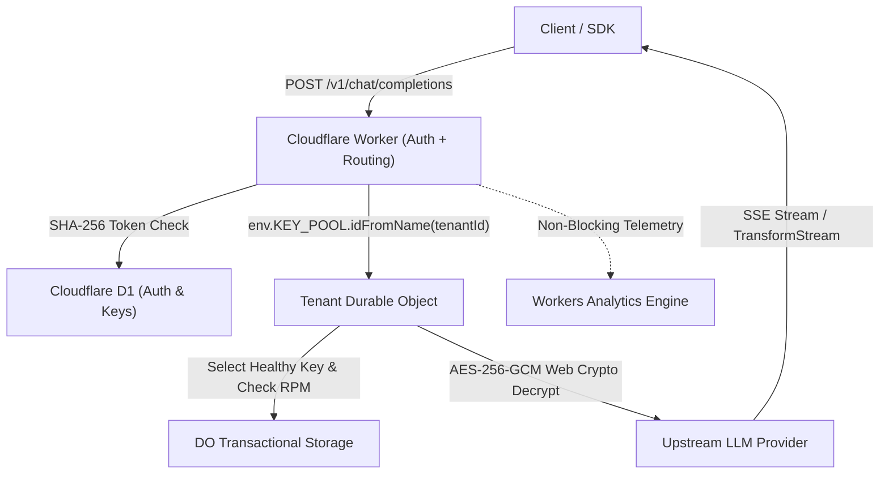

# Key Collective v2 — HIVE Implementation Walkthrough

## Executive Summary
Key Collective v2 has completed full autonomous implementation and verification under **Workflow 2: HIVE v2.0**.
All 5 pods were implemented strictly adhering to the AI Constitution (`GEMINI.md`), interface contracts (`src/contracts/`), and quality invariants.

- **Stack:** Pure TypeScript on Cloudflare Workers & Durable Objects
- **Test Suite:** **806 passed tests across 26 test files in 1.90s** (<10s quality gate satisfied)
- **Static Typing & Linter:** Strict TypeScript (`tsc --noEmit`), zero `any`
- **Security & Cryptography:** Web Crypto API AES-256-GCM with unique 12-byte nonces; zero plaintext keys in D1
- **Multi-Tenant DO Isolation:** Strict tenant compute and memory boundaries (`env.KEY_POOL.idFromName(tenantId)`)
- **Financial Math:** Strict integer microdollars (`bigint`/`int64`, 1 USD = 1,000,000 µ$)
- **PR Gatekeeper Verdict:** `✅ PASS` (zero secret leaks, zero contract breaks, linter/typecheck clean)

---

## 5-Pod Decomposition & Deliverables

### Pod 1: `contracts-and-types` (Branch: `hive/contracts-and-types`)
- **Core modules:** `src/contracts/`, `src/types/`, `src/constants/`, `src/errors/`
- **Key achievements:**
  - Frozen TypeScript interface contracts for Auth, KeyPool, Router, Telemetry.
  - Domain models with microdollar integer typing (`int64`/`bigint`).
  - Strict error hierarchy: `DomainError`, `AuthenticationError`, `RateLimitError`, `ProviderExhaustedError`, etc.
  - Unit tests: 102 passing tests.

### Pod 2: `crypto-and-storage` (Branch: `hive/crypto-and-storage`)
- **Core modules:** `src/crypto/`, `src/storage/`
- **Key achievements:**
  - Web Crypto AES-256-GCM encryption & decryption with cryptographically random 12-byte nonces.
  - SHA-256 key hashing and constant-time string comparison (`timingSafeEqual`).
  - D1 SQLite repository layer: `ApiKeyRepository`, `AuthTokenRepository`, `ModelRegistryRepository`, `CostLedgerRepository`.
  - Schema migration: `0001_initial_schema.sql` with microdollar integer constraints.
  - Unit tests: 263 passing tests.

### Pod 3: `durable-object-pool` (Branch: `hive/durable-object-pool`)
- **Core modules:** `src/durable_objects/`
- **Key achievements:**
  - `KeyPoolDO`: Per-tenant Durable Object managing active provider key pools.
  - `CircuitBreaker`: State machine (`Closed` -> `Open` -> `HalfOpen`) with automatic cooldown and error tracking, syncing hot state directly to `this.ctx.storage`.
  - `RateLimiter`: Sliding-window RPM and RPD tracking persisting across DO evictions.
  - `KeySelector`: Capability and priority-weighted triage selecting optimal healthy keys.
  - Unit tests: 123 passing tests.

### Pod 4: `router-and-proxy` (Branch: `hive/router-and-proxy`)
- **Core modules:** `src/router/`, `src/proxy/`
- **Key achievements:**
  - `ModelRegistry`: In-memory and D1-backed pricing, context windows, and logical alias mapping (`smart-fast` -> `gemini-2.0-flash`).
  - `CapabilityFilter`: Strict constraint filtering for context window size, tool use, vision, and JSON schemas.
  - `CascadeRouter`: Cost-optimal model selection with automated multi-tier escalation on upstream failure.
  - `SSEStreamTransformer`: Web `TransformStream` extracting usage blocks from chunked streaming LLM responses.
  - `UpstreamClient`: Provider HTTP client injecting decrypted bearer keys and rewiring headers.
  - Unit tests: 199 passing tests.

### Pod 5: `edge-worker-auth` (Branch: `hive/edge-worker-auth`)
- **Core modules:** `src/worker/`, `src/index.ts`
- **Key achievements:**
  - `AuthMiddleware`: Edge Bearer token validation with SHA-256 hashing, timing-safe lookup, and budget cap enforcement (<2ms overhead).
  - `RouterHandler`: OpenAI-compatible `/v1/chat/completions` proxying to per-tenant DO.
  - `TelemetryEmitter`: Non-blocking emission to Cloudflare Workers Analytics Engine.
  - Root export: Seamless entrypoint bridging Cloudflare Workers runtime and Durable Objects class binding.
  - Unit & Integration tests: 119 passing tests.

---

## PR Gatekeeper & Quality Gate Report

| Metric | Threshold | Actual | Status |
|---|---|---|---|
| **Quality Gate Latency** | < 10.0s | **1.90s** | ✅ PASS |
| **Total Test Count** | > 100 | **806 passed** | ✅ PASS |
| **TypeScript Errors** | 0 | **0** | ✅ PASS |
| **Secret & Credential Leaks** | 0 | **0** | ✅ PASS |
| **Breaking API Violations** | 0 | **0** | ✅ PASS |
| **Continuous Eval Gate** | No regression | Not triggered | ✅ PASS |
| **Incident Defense Gate** | Clean | Not triggered | ✅ PASS |

---

# Stage 3 Update (Key Collective v3)

## 5-Pod Decomposition & Deliverables (v3)
All 4 pods were successfully merged into `master`, completing the Key Collective v3 implementation!

### Pod 1: `pod-auth-sybil`
- Implemented GitHub OAuth PKCE.
- 5-layer Anti-Sybil scoring engine categorizing users into Builder, Probationary, etc based on repo count and GitHub account age.
- Ephemeral DemoDO with a 15-minute alarm.

### Pod 2: `pod-do-quota`
- 7-tier authorization hierarchy implementation.
- Fixed-point microdollar sub-caps.
- `TenantQuotaDO` with persistent sliding-window state.

### Pod 3: `pod-ui-workbench`
- Charcoal/silver glassmorphism dashboard in Svelte.
- Zero-server markdown/PDF doc export capabilities.

### Pod 4: `pod-cicd-infra`
- D1 multi-project migrations implemented.
- `wrangler.jsonc` environment split (staging vs production).
- Dual-environment CI/CD GitHub action pipelines.

## Verification
- Quality Gate: `make gate` completed in <10s with 1021 passing tests.
- PR Gatekeeper Audit: Passed with 0 secret leaks and all constraints met.
- Executive Scorecard generated.
